<link href="http://kevinburke.bitbucket.org/markdowncss/markdown.css" rel="stylesheet"></link>


# Step 02 - Loading and Processing DNA/RNA Alignment Data

Using the `chiptools` python package that I wrote, I have created a list of unique trimmed and merge reads (contigs) and the number of times they appear in each replicate library. For the 202 analysis I used `rna_table.py` in the chiptools package to create RNA/DNA measurements and remove spurrious contigs. For 203, we will use R instead, so we can be more thorough in checking. Also because while Python is the bee's knees, PANDAS is slow, lame, and missing functionality. 

## Getting limits on RNA and DNA lengths

In order to throw away spurrious reads and avoid wasting time on alignments, we want to know what the shortest and longest legitimate RNA and DNA alignments are. We can use the `lib_seqs` DataFrame that we computed in `01`. 


```r

seq_cols <- grep(".seq", names(lib_seqs))
lib_seqs$Length <- nchar(apply(apply(lib_seqs[, seq_cols], 1, as.character), 
    2, paste, collapse = ""))

table(lib_seqs$Length)
```


```
## 
##   91   92   93   94 
## 3562 3562 3562 3562 
```


### DNA min/max lengths

All of the library members are between 91 and 94 bases. For the DNA, we just check that all sequences are between 91 and 94 bases. 

* **DNA min/max - 91,94**

### RNA min/max lengths

For the RNA, we want to throw away anything that might be DNA (too long) and also throw away anything that is too short. 

If it is too short then the promoter won't be identifiable. Since we saw in `01` that the RBS length is between 18 and 21, and we only one base of the barcode, since we only have two promoters. It might be a good idea to make sure that one of the three allowed mismatches is not the last base of the barcode. Therefore the shortest RNA allowed should be 33 (CDS) + 18 (shortest RBS) + 1 (last base of barcode) = 52.

If it is more than 90 bases, then it could possibly be DNA, so we'll remove it. If it is less than 90, then it could be DNA with deletions, but since bowtie only matches with mismatches (not indels) we should be safe from that. 

* **RNA min/max - 52,90**

Finally, I am also filtering on there being at least 4 reads for a unique 
read, meaning we need to see two reads on average in each replicate.

## Running Bowtie on RNA and DNA

This was done on the `GMC` server, but I am putting the shell code that I ran here.

### Bowtie Settings

`-k 114` | report up to 114 alignments per contig
`-v 3` | 3 mismatches per contig (no indels)
`-l 10` | seed length of 10
`-p 16` | use all 16 processors

### Input 

My read names are 4 tab-separated fields, read number, count, bin 1, bin 2. They are in FASTA format; the perl takes them as they get fed into bowtie and filters them for size. 

### File Locations on GMC

```bash
lib_prefix=/scratch/dbg/ecre/fa/203.norestrict
out_prefix=/scratch/dbg/ecre/203_hs
dna_prefix=/scratch/dbg/ecre/ct/203_hsdna/203_hsdna.counts
rna_prefix=/scratch/dbg/ecre/ct/203_hsrna/203_hsrna.counts
```

### Some read length distribution analysis

Using some bash scripting I got the RNA and DNA contig length distributions before filtering:

```console

$ perl -pe 's/([^ATGC])\n/$1\t/' $dna_prefix.fa | perl -ne '@l = split; print length($l[4])."\n";' | sort -nr | uniq -c

$ perl -pe 's/([^ATGC])\n/$1\t/' $rna_prefix.fa | perl -ne '@l = split; print length($l[4])."\n";' | sort -nr | uniq -c
```

These of course contain the spike-ins for the 202 library, so we have to keep that in mind, but it is interesting nonetheless. I cleaned up the output and made them into tsvs, and put them in `data/203.dna_hist.txt` and `data/203.rna_hist.txt`. 


```r
# load the text files I made with bash scripts
dna_read_lengths <- read.table(file = paste(getwd(), "/data/203.dna_hist.txt", 
    sep = ""), sep = "\t", header = T, row.names = NULL, col.names = c("count", 
    "length"))
rna_read_lengths <- read.table(file = paste(getwd(), "/data/203.rna_hist.txt", 
    sep = ""), sep = "\t", header = T, row.names = NULL, col.names = c("count", 
    "length"))

# combine them into one DF
read_lengths <- melt(merge(dna_read_lengths, rna_read_lengths, by = "length", 
    suffixes = c(".dna", ".rna")), id.vars = "length")

# plot
ggplot(read_lengths, aes(x = length, y = value)) + geom_line(aes(colour = variable)) + 
    scale_y_log10(breaks = 10^(1:6), name = "contig count (log10)") + scale_x_continuous(name = "length (bp)")
```

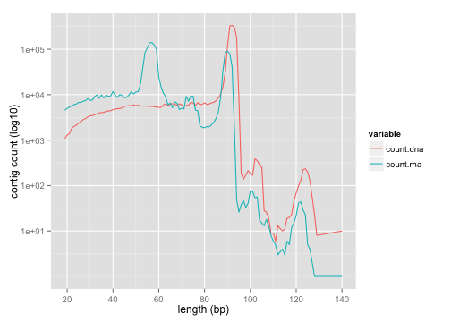 


This looks right; there is a big hump for the RNA at about 55 bp, and most of the DNA looks like it is around 91 to 94 bp. The hump for the RNA in that same region is maybe DNA contamination. The longer things (100+ bp) are perhaps concatamers, but it is unclear. It is interesting how much junk there is in the DNA. As I mentioned, the 202 library is adding some peaks (perhaps the jagged ones between 30 and 50 bp). 

### Run Bowtie

> Note: the RNA/DNA min/max I arrived at above are hard-coded in the perl below.  

```bash
#build the bowtie index
bowtie-build /scratch/dbg/ecre/fa/203.norestrict.fa \
    /scratch/dbg/ecre/fa/203.norestrict

#perform bowtie for DNA
bowtie -v 3 -l 10 -k 114 -p 16 \
    --norc --best --strata --suppress 2,6 \
    --un $out_prefix.unmapped.fa -f $lib_prefix  \
    <(perl -pe 's/([^ATGC])\n/$1\t/' $dna_prefix.fa \
    | perl -ne '@l = split; ($l[1] > 4
        && length($l[4]) <= 94 && length($l[4]) >= 91) 
        && (s/\t([ATGC])/\n$1/ && print);') \
    > $out_prefix.dna.bowtie
        
#perform bowtie for RNA
bowtie -v 3 -l 10 -k 114 -p 16 \
    --norc --best --strata --suppress 2,6 \
    --un $out_prefix.unmapped.fa -f $lib_prefix  \
    <(perl -pe 's/([^ATGC])\n/$1\t/' $rna_prefix.fa \
    | perl -ne '@l = split; ($l[1] > 4
        && length($l[4]) < 90 && length($l[4]) > 52) 
        && (s/\t([ATGC])/\n$1/ && print);') \
    > $out_prefix.rna.bowtie
```

### Bowtie Output Summaries
For DNA:
```
# reads processed: 1140587
# reads with at least one reported alignment: 837696 (73.44%)
# reads that failed to align: 302891 (26.56%)
Reported 842175 alignments to 1 output stream(s)
```
For RNA:
```
# reads processed: 1028684
# reads with at least one reported alignment: 663124 (64.46%)
# reads that failed to align: 365560 (35.54%)
Reported 689549 alignments to 1 output stream(s)
```

More contigs failed to align than I expected, but some may be due to the 202 spike-in library. I copied `/scratch/dbg/ecre/*.bowtie` to the project, though the files were pretty big. I put them in the `data/` dir and will add them to the `.gitignore` file.

### Output Format

More info can be found in the online [Bowtie docs](http://bowtie-bio.sourceforge.net/manual.shtml#default-bowtie-output).

```
01 Name of read that aligned
02 Total read count
03 Read count in bin 1
04 Read count in bin 2
(suppressed) Reference strand aligned to
05 Name of reference sequence where alignment occurs
06 0-based offset into the forward reference strand 
07 Read sequence
(suppressed) Read qualities
08 Number of other alignments for this RNA
09 Mismatches (base:N>N, ... )

```

## Annotating the Bowtie Output

Now I want to follow the path I took in `rna_table.py`. There are several steps required for both RNA and DNA:
1. Get the sequence length 
2. Get the corresponding library member length
3. Get the righthand offset from the lefthand offset and member length

Additionally, only keep RNA that has:
1. a single best alignment
2. an offset of at least 2

For DNA:
1. a single best alignment
2. aligns end to end (left and right offset of 0)


```r

# load the raw bowtie output, add library annotation data, and get lengths
# and offset info
col.names = c("Read.num", "Count", "Count.A", "Count.B", "Name", 
    "Offset.L", "Read.seq", "Alts", "Mismatches")

load_raw_reads <- function(filename, is.rna, col.names) {
    raw <- read.table(file = filename, sep = "\t", header = F, row.names = NULL, 
        stringsAsFactors = F, col.names = col.names)
    
    
    raw <- merge(raw, lib_seqs, by = "Name")
    raw$Read.len <- nchar(raw$Read.seq)
    raw$Offset.R <- raw$Length - raw$Read.len - raw$Offset.L
    
    raw$Mismatches[is.na(raw$Mismatches)] <- ""
    raw$Mismatches.len <- unlist(lapply(raw$Mismatches, function(x) length(unlist(strsplit(x, 
        ",", fixed = T)))))
    
    return(raw)
}

dna.raw <- load_raw_reads(file = paste(getwd(), "/data/203.dna.bowtie", 
    sep = ""), is.rna = F, col.names)
rna.raw <- load_raw_reads(file = paste(getwd(), "/data/203.rna.bowtie", 
    sep = ""), is.rna = T, col.names)
```


Also, we should get the RNA start position relative to the Promoter/RBS junction. Take the left offset and subtract 40, the length of promoter (constant between the two).


```r
rna.raw$Offset.RBS <- with(rna.raw, Offset.L - 40)
```


### Exploratory Plots

Before we filter, let's just look at some plots. 


```r

ggplot(rna.raw, aes(x = Offset.L)) + geom_bar(aes(fill = cut(rna.raw$Alts, 
    breaks = c(-Inf, 0, 1, 100, Inf), labels = c("None", "One", "> 1", "> 100")))) + 
    scale_x_continuous(name = "Left Offset of RNA") + scale_fill_discrete(name = "Number of Alternate Alignments")
```

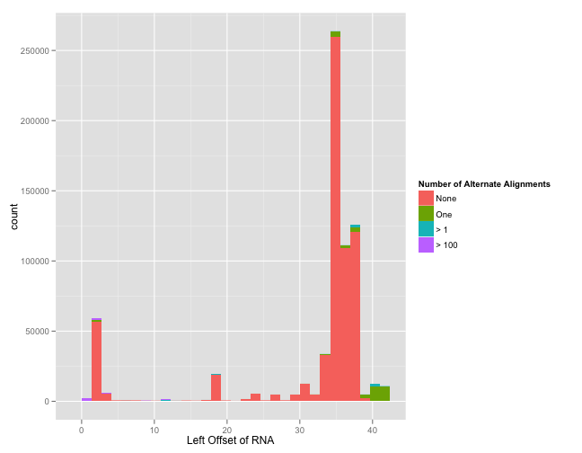 

```r

ggplot(rna.raw, aes(x = Offset.R)) + geom_bar(aes(fill = cut(rna.raw$Alts, 
    breaks = c(-Inf, 0, 1, 100, Inf), labels = c("None", "One", "> 1", "> 100")))) + 
    scale_x_continuous(limits = c(1, 50), name = "Right Offset of RNA (hiding 0)") + 
    scale_fill_discrete(name = "Number of Alternate Alignments")
```

 

```r

ggplot(subset(melt(cast(rna.raw, Alts ~ Promoter, fill = NA)), !is.na(value)), 
    aes(x = Alts, y = Promoter, fill = log10(value))) + geom_tile()
```

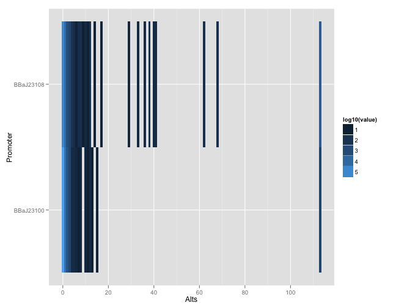 

```r

ggplot(subset(melt(cast(rna.raw, Alts ~ RBS, fill = NA)), !is.na(value)), 
    aes(x = Alts, y = RBS, fill = log10(value))) + geom_tile()
```

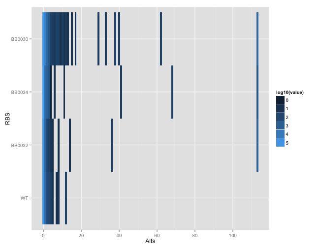 

```r

ggplot(subset(melt(cast(rna.raw, Alts ~ Offset.L, fill = NA)), !is.na(value)), 
    aes(x = Alts, y = Offset.L)) + geom_point()
```

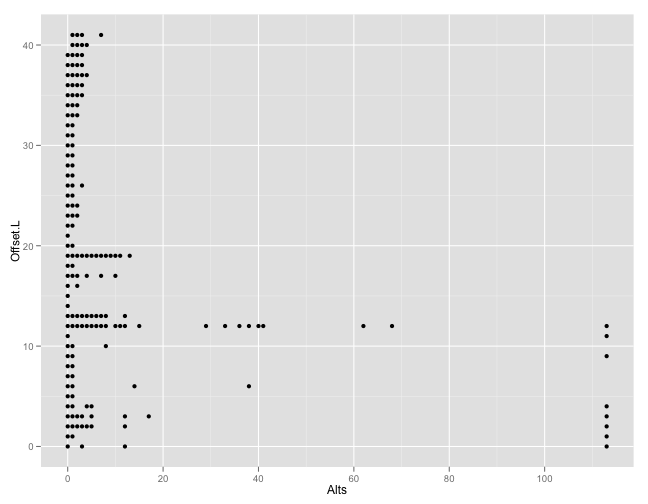 

```r

ggplot(subset(melt(cast(rna.raw, Alts ~ Offset.R, value = "Name", 
    fill = NA)), !is.na(value)), aes(x = Alts, y = Offset.R)) + geom_point()
```

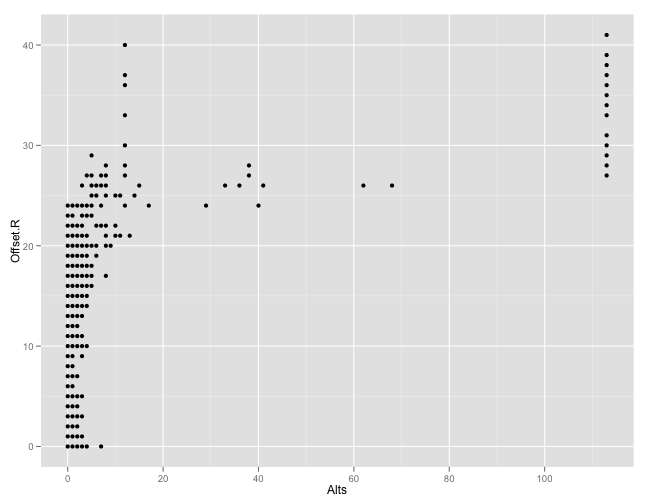 

```r

ggplot(subset(melt(cast(rna.raw, Alts ~ Mismatches.len, value = "Name", 
    fill = NA)), !is.na(value)), aes(x = Alts, y = Mismatches.len, fill = log10(value))) + 
    geom_tile()
```

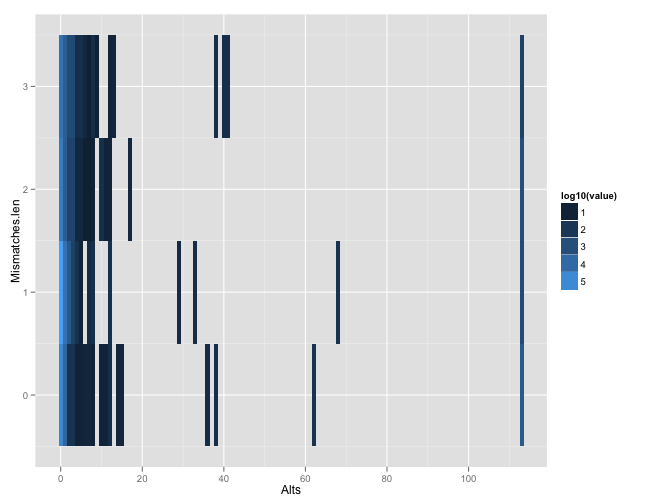 

```r

ggplot(subset(melt(cast(rna.raw, Offset.L ~ Offset.R, value = "Name", 
    fill = NA)), !is.na(value)), aes(x = Offset.L, y = Offset.R, fill = log10(value))) + 
    geom_tile()
```

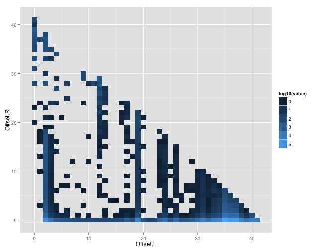 


So, a lot is going on here. 

* Most of the reads with multiple alignments have a left offset of 40 or greater, corresponding to a late RNA start perhaps. 
* The `BBaJ23108` promoter has a lot more multiple alignments than `BBaJ23100`.
* There are also differences in multiple alignments per RBS, with `BB0030` having the most, and the WT having none of the super-high multiple aligners (aligning to 120 seqs).

## Filtering contigs

We could make these plots all night, but let's just subset based on our aforementioned criteria and see where we are. 


```r

rna.criteria <- with(rna.raw, Alts == 0 & Offset.L > 2 & Offset.R == 
    0)
dna.criteria <- with(dna.raw, Alts == 0 & Offset.L == 0 & Offset.R == 
    0)

rna.subset <- subset(rna.raw, rna.criteria)
dna.subset <- subset(dna.raw, dna.criteria)

rna.discard <- subset(rna.raw, !rna.criteria)
dna.discard <- subset(dna.raw, !dna.criteria)


# Before and after Subsetting:
print(xtable(rbind(dna = cbind(read = "dna", `before subset` = dim(dna.raw)[1], 
    `after subset` = dim(dna.subset)[1]), rna = cbind(read = "rna", `before subset` = dim(rna.raw)[1], 
    `after subset` = dim(rna.subset)[1]))), "html")
```


```
## <!-- html table generated in R 2.14.1 by xtable 1.7-0 package -->
## <!-- Fri Oct 12 09:41:09 2012 -->
## <TABLE border=1>
## <TR> <TH>  </TH> <TH> read </TH> <TH> before subset </TH> <TH> after subset </TH>  </TR>
##   <TR> <TD align="right"> 1 </TD> <TD> dna </TD> <TD> 842175 </TD> <TD> 800414 </TD> </TR>
##   <TR> <TD align="right"> 2 </TD> <TD> rna </TD> <TD> 689549 </TD> <TD> 567351 </TD> </TR>
##    </TABLE>
```


```r

# Missing from DNA
dna.missing <- lib_seqs$Name[which(!(lib_seqs$Name %in% dna.subset$Name))]
dna.missing
```


```
##  [1] BBaJ23100-bamA-4  BBaJ23108-bamA-4  BBaJ23100-bamA-1 
##  [4] BBaJ23108-bamA-1  BBaJ23100-bamA-13 BBaJ23108-bamA-13
##  [7] BBaJ23100-bamA-15 BBaJ23108-bamA-15 BBaJ23100-bamA-22
## [10] BBaJ23108-bamA-22 BBaJ23100-yejM-5  BBaJ23108-yejM-5 
## [13] BBaJ23100-yejM-15 BBaJ23108-yejM-15 BBaJ23100-cysS-5 
## [16] BBaJ23108-cysS-5  BBaJ23100-cysS-18 BBaJ23108-cysS-18
## [19] BBaJ23100-bamA-2  BBaJ23108-bamA-2  BBaJ23108-bamA-23
## [22] BBaJ23100-serS-6  BBaJ23108-serS-6  BBaJ23100-serS-27
## [25] BBaJ23108-serS-27 BBaJ23100-aspS-5  BBaJ23108-aspS-5 
## [28] BBaJ23100-aspS-16 BBaJ23108-aspS-16 BBaJ23100-rpsB-7 
## [31] BBaJ23108-rpsB-7  BBaJ23100-rpsB-40 BBaJ23108-rpsB-40
## [34] BBaJ23100-bamA-3  BBaJ23108-bamA-3  BBaJ23100-mrdB-7 
## [37] BBaJ23108-mrdB-7  BBaJ23100-mrdB-39 BBaJ23108-mrdB-39
## [40] BBaJ23100-lolA-7  BBaJ23108-lolA-7  BBaJ23100-lolA-41
## [43] BBaJ23108-lolA-41
## 14248 Levels: BBaJ23100-accA-1 BBaJ23100-accA-10 ... BBaJ23108-zipA-9
```


```r

# Missing from RNA
rna.missing <- lib_seqs$Name[which(!(lib_seqs$Name %in% rna.subset$Name))]
rna.missing
```


```
##  [1] BBaJ23100-yejM-5  BBaJ23108-yejM-5  BBaJ23100-yejM-15
##  [4] BBaJ23108-yejM-15 BBaJ23100-cysS-5  BBaJ23108-cysS-5 
##  [7] BBaJ23100-cysS-18 BBaJ23108-cysS-18 BBaJ23100-serS-6 
## [10] BBaJ23108-serS-6  BBaJ23100-serS-27 BBaJ23108-serS-27
## [13] BBaJ23108-dnaX-9  BBaJ23108-metK-18 BBaJ23108-lnt-16 
## [16] BBaJ23108-nadK-16 BBaJ23108-murG-5  BBaJ23100-aspS-5 
## [19] BBaJ23108-aspS-5  BBaJ23100-aspS-16 BBaJ23108-aspS-16
## [22] BBaJ23108-murJ-15 BBaJ23108-ileS-42 BBaJ23108-lptD-3 
## [25] BBaJ23108-murC-42 BBaJ23100-rpsB-7  BBaJ23108-rpsB-7 
## [28] BBaJ23100-rpsB-40 BBaJ23108-rpsB-40 BBaJ23108-pyrH-33
## [31] BBaJ23108-ispA-34 BBaJ23108-hemH-40 BBaJ23100-mrdB-7 
## [34] BBaJ23108-mrdB-7  BBaJ23100-mrdB-39 BBaJ23108-mrdB-39
## [37] BBaJ23100-lolA-7  BBaJ23108-lolA-7  BBaJ23100-lolA-41
## [40] BBaJ23108-lolA-41 BBaJ23108-aspS-37 BBaJ23108-rplS-33
## [43] BBaJ23108-holA-19 BBaJ23108-ispH-5  BBaJ23108-serS-20
## 14248 Levels: BBaJ23100-accA-1 BBaJ23100-accA-10 ... BBaJ23108-zipA-9
```


```r

# Missing from both
both.missing <- lib_seqs$Name[which(!(lib_seqs$Name %in% dna.subset$Name | 
    lib_seqs$Name %in% rna.subset$Name))]
both.missing
```


```
##  [1] BBaJ23100-yejM-5  BBaJ23108-yejM-5  BBaJ23100-yejM-15
##  [4] BBaJ23108-yejM-15 BBaJ23100-cysS-5  BBaJ23108-cysS-5 
##  [7] BBaJ23100-cysS-18 BBaJ23108-cysS-18 BBaJ23100-serS-6 
## [10] BBaJ23108-serS-6  BBaJ23100-serS-27 BBaJ23108-serS-27
## [13] BBaJ23100-aspS-5  BBaJ23108-aspS-5  BBaJ23100-aspS-16
## [16] BBaJ23108-aspS-16 BBaJ23100-rpsB-7  BBaJ23108-rpsB-7 
## [19] BBaJ23100-rpsB-40 BBaJ23108-rpsB-40 BBaJ23100-mrdB-7 
## [22] BBaJ23108-mrdB-7  BBaJ23100-mrdB-39 BBaJ23108-mrdB-39
## [25] BBaJ23100-lolA-7  BBaJ23108-lolA-7  BBaJ23100-lolA-41
## [28] BBaJ23108-lolA-41
## 14248 Levels: BBaJ23100-accA-1 BBaJ23100-accA-10 ... BBaJ23108-zipA-9
```


28 are missing from both, 43 are missing from DNA, and 45 are missing from RNA. Let's see if they appear in the unfiltered reads.

## Recovering Lost Contigs


```r
rna.reads_for_missing <- subset(rna.raw, Read.num %in% subset(rna.raw, 
    Name %in% rna.missing & Count > 200)$Read.num)[, !grepl("seq", names(rna.raw))]
rna.reads_for_missing[order(rna.reads_for_missing$Read.num), ]
```


```
##                     Name Read.num Count Count.A Count.B Offset.L Alts
## 557099 BBaJ23100-yejM-15   104353   777     441     336       37    1
## 559798  BBaJ23100-yejM-5   104353   777     441     336       37    1
## 58022  BBaJ23100-cysS-18   108136   958     556     402       37    1
## 61889   BBaJ23100-cysS-5   108136   958     556     402       37    1
## 513203 BBaJ23100-serS-27   125037   927     520     407       37    1
## 515988  BBaJ23100-serS-6   125037   927     520     407       37    1
## 28575  BBaJ23100-aspS-16   153619   509     308     201       37    1
## 31395   BBaJ23100-aspS-5   153619   509     308     201       37    1
## 302265 BBaJ23100-lolA-41   168777  1705    1011     694       37    1
## 304797  BBaJ23100-lolA-7   168777  1705    1011     694       37    1
## 365419 BBaJ23100-mrdB-39   172333  1124     638     486       37    1
## 366936  BBaJ23100-mrdB-7   172333  1124     638     486       37    1
## 502802 BBaJ23100-rpsB-40   181908   896     492     404       37    1
## 504244  BBaJ23100-rpsB-7   181908   896     492     404       37    1
## 677855 BBaJ23108-serS-27   250029   307     187     120       36    1
## 678482  BBaJ23108-serS-6   250029   307     187     120       36    1
## 557098 BBaJ23100-yejM-15  1012393   288     130     158       36    1
## 559754  BBaJ23100-yejM-5  1012393   288     130     158       36    1
## 57973  BBaJ23100-cysS-18  1014195  1046     633     413       36    1
## 61915   BBaJ23100-cysS-5  1014195  1046     633     413       36    1
## 513222 BBaJ23100-serS-27  1025817   662     406     256       36    1
## 516021  BBaJ23100-serS-6  1025817   662     406     256       36    1
## 28566  BBaJ23100-aspS-16  1047189   884     545     339       36    1
## 31404   BBaJ23100-aspS-5  1047189   884     545     339       36    1
## 302286 BBaJ23100-lolA-41  1055530  1589    1062     527       36    1
## 304778  BBaJ23100-lolA-7  1055530  1589    1062     527       36    1
## 365425 BBaJ23100-mrdB-39  1058615   669     447     222       36    1
## 366875  BBaJ23100-mrdB-7  1058615   669     447     222       36    1
## 502768 BBaJ23100-rpsB-40  1066710   564     333     231       36    1
## 504254  BBaJ23100-rpsB-7  1066710   564     333     231       36    1
## 557129 BBaJ23100-yejM-15  1276876   759     441     318       35    1
## 559780  BBaJ23100-yejM-5  1276876   759     441     318       35    1
## 58045  BBaJ23100-cysS-18  1282988  4636    2751    1885       35    1
## 61949   BBaJ23100-cysS-5  1282988  4636    2751    1885       35    1
## 513144 BBaJ23100-serS-27  1330825  3596    2108    1488       35    1
## 515921  BBaJ23100-serS-6  1330825  3596    2108    1488       35    1
## 28550  BBaJ23100-aspS-16  1417790  4341    2339    2002       35    1
## 31476   BBaJ23100-aspS-5  1417790  4341    2339    2002       35    1
## 302248 BBaJ23100-lolA-41  1443162  5090    3002    2088       35    1
## 304741  BBaJ23100-lolA-7  1443162  5090    3002    2088       35    1
## 365454 BBaJ23100-mrdB-39  1452520  2646    1597    1049       35    1
## 366902  BBaJ23100-mrdB-7  1452520  2646    1597    1049       35    1
## 502755 BBaJ23100-rpsB-40  1477479  2236    1305     931       35    1
## 504242  BBaJ23100-rpsB-7  1477479  2236    1305     931       35    1
##        Mismatches  Promoter Gene CDS.num    RBS CDS.type RBS.len Length
## 557099            BBaJ23100 yejM      15     WT     ∆G 3      20     93
## 559798            BBaJ23100 yejM       5     WT Min Rare      20     93
## 58022             BBaJ23100 cysS      18     WT     ∆G 6      20     93
## 61889             BBaJ23100 cysS       5     WT Min Rare      20     93
## 513203            BBaJ23100 serS      27 BB0030     ∆G 5      21     94
## 515988            BBaJ23100 serS       6 BB0030 Min Rare      21     94
## 28575             BBaJ23100 aspS      16     WT     ∆G 4      20     93
## 31395             BBaJ23100 aspS       5     WT Min Rare      20     93
## 302265            BBaJ23100 lolA      41 BB0032     ∆G 9      19     92
## 304797            BBaJ23100 lolA       7 BB0032 Min Rare      19     92
## 365419            BBaJ23100 mrdB      39 BB0032     ∆G 7      19     92
## 366936            BBaJ23100 mrdB       7 BB0032 Min Rare      19     92
## 502802            BBaJ23100 rpsB      40 BB0032     ∆G 8      19     92
## 504244            BBaJ23100 rpsB       7 BB0032 Min Rare      19     92
## 677855            BBaJ23108 serS      27 BB0030     ∆G 5      21     94
## 678482            BBaJ23108 serS       6 BB0030 Min Rare      21     94
## 557098            BBaJ23100 yejM      15     WT     ∆G 3      20     93
## 559754            BBaJ23100 yejM       5     WT Min Rare      20     93
## 57973             BBaJ23100 cysS      18     WT     ∆G 6      20     93
## 61915             BBaJ23100 cysS       5     WT Min Rare      20     93
## 513222            BBaJ23100 serS      27 BB0030     ∆G 5      21     94
## 516021            BBaJ23100 serS       6 BB0030 Min Rare      21     94
## 28566             BBaJ23100 aspS      16     WT     ∆G 4      20     93
## 31404             BBaJ23100 aspS       5     WT Min Rare      20     93
## 302286            BBaJ23100 lolA      41 BB0032     ∆G 9      19     92
## 304778            BBaJ23100 lolA       7 BB0032 Min Rare      19     92
## 365425            BBaJ23100 mrdB      39 BB0032     ∆G 7      19     92
## 366875            BBaJ23100 mrdB       7 BB0032 Min Rare      19     92
## 502768            BBaJ23100 rpsB      40 BB0032     ∆G 8      19     92
## 504254            BBaJ23100 rpsB       7 BB0032 Min Rare      19     92
## 557129            BBaJ23100 yejM      15     WT     ∆G 3      20     93
## 559780            BBaJ23100 yejM       5     WT Min Rare      20     93
## 58045             BBaJ23100 cysS      18     WT     ∆G 6      20     93
## 61949             BBaJ23100 cysS       5     WT Min Rare      20     93
## 513144            BBaJ23100 serS      27 BB0030     ∆G 5      21     94
## 515921            BBaJ23100 serS       6 BB0030 Min Rare      21     94
## 28550             BBaJ23100 aspS      16     WT     ∆G 4      20     93
## 31476             BBaJ23100 aspS       5     WT Min Rare      20     93
## 302248            BBaJ23100 lolA      41 BB0032     ∆G 9      19     92
## 304741            BBaJ23100 lolA       7 BB0032 Min Rare      19     92
## 365454            BBaJ23100 mrdB      39 BB0032     ∆G 7      19     92
## 366902            BBaJ23100 mrdB       7 BB0032 Min Rare      19     92
## 502755            BBaJ23100 rpsB      40 BB0032     ∆G 8      19     92
## 504242            BBaJ23100 rpsB       7 BB0032 Min Rare      19     92
##        Read.len Offset.R Mismatches.len Offset.RBS
## 557099       56        0              0         -3
## 559798       56        0              0         -3
## 58022        56        0              0         -3
## 61889        56        0              0         -3
## 513203       57        0              0         -3
## 515988       57        0              0         -3
## 28575        56        0              0         -3
## 31395        56        0              0         -3
## 302265       55        0              0         -3
## 304797       55        0              0         -3
## 365419       55        0              0         -3
## 366936       55        0              0         -3
## 502802       55        0              0         -3
## 504244       55        0              0         -3
## 677855       58        0              0         -4
## 678482       58        0              0         -4
## 557098       57        0              0         -4
## 559754       57        0              0         -4
## 57973        57        0              0         -4
## 61915        57        0              0         -4
## 513222       58        0              0         -4
## 516021       58        0              0         -4
## 28566        57        0              0         -4
## 31404        57        0              0         -4
## 302286       56        0              0         -4
## 304778       56        0              0         -4
## 365425       56        0              0         -4
## 366875       56        0              0         -4
## 502768       56        0              0         -4
## 504254       56        0              0         -4
## 557129       58        0              0         -5
## 559780       58        0              0         -5
## 58045        58        0              0         -5
## 61949        58        0              0         -5
## 513144       59        0              0         -5
## 515921       59        0              0         -5
## 28550        58        0              0         -5
## 31476        58        0              0         -5
## 302248       57        0              0         -5
## 304741       57        0              0         -5
## 365454       57        0              0         -5
## 366902       57        0              0         -5
## 502755       57        0              0         -5
## 504242       57        0              0         -5
```


### Duplicate Library Members

It looks like there are some high-count reads that map doubly. It appears that some of the Min Rare CDSes have the exact same sequences as the ∆G RBSes. To confirm, I will check the original library FASTA file. 

```console
$ grep -Pi '^[ATGC]+' $lib_prefix.fa | sort | uniq -c | grep -Pv '^\s+1'      2 ctgacagctagctcagtcctaggtataatgctagcCACCGAGGGAAACAGATAACAGGTTATGGTGACCCATCGCCAGCGCTATCGCGAAAAA
      2 ctgacagctagctcagtcctaggtataatgctagcCACCGATGTCTAAACGGAATCTTCGATGCTGAAAATTTTTAACACCCTGACCCGCCAG
      2 ctgacagctagctcagtcctaggtataatgctagcCACCGATTAAAGAGGAGAAAtactagATGCTGGATCCGAACCTGCTGCGCAACGAACCG
      2 ctgacagctagctcagtcctaggtataatgctagcCACCGGCTAAGTTAAGGGATATCTCATGCGCACCGAATATTGCGGCCAGCTGCGCCTG
      2 ctgacagctagctcagtcctaggtataatgctagcCACCGTCACACAGGAAAGtactagATGAAAAAAATTGCGATTACCTGCGCGCTGCTG
      2 ctgacagctagctcagtcctaggtataatgctagcCACCGTCACACAGGAAAGtactagATGACCGATAACCCGAACAAAAAAACCTTTTGG
      2 ctgacagctagctcagtcctaggtataatgctagcCACCGTCACACAGGAAAGtactagATGGCGACCGTGAGCATGCGCGATATGCTGAAA
      2 ttgacggctagctcagtcctaggtacagtgctagcTTAATAGGGAAACAGATAACAGGTTATGGTGACCCATCGCCAGCGCTATCGCGAAAAA
      2 ttgacggctagctcagtcctaggtacagtgctagcTTAATATGTCTAAACGGAATCTTCGATGCTGAAAATTTTTAACACCCTGACCCGCCAG
      2 ttgacggctagctcagtcctaggtacagtgctagcTTAATATTAAAGAGGAGAAAtactagATGCTGGATCCGAACCTGCTGCGCAACGAACCG
      2 ttgacggctagctcagtcctaggtacagtgctagcTTAATGCTAAGTTAAGGGATATCTCATGCGCACCGAATATTGCGGCCAGCTGCGCCTG
      2 ttgacggctagctcagtcctaggtacagtgctagcTTAATTCACACAGGAAAGtactagATGAAAAAAATTGCGATTACCTGCGCGCTGCTG
      2 ttgacggctagctcagtcctaggtacagtgctagcTTAATTCACACAGGAAAGtactagATGACCGATAACCCGAACAAAAAAACCTTTTGG
      2 ttgacggctagctcagtcctaggtacagtgctagcTTAATTCACACAGGAAAGtactagATGGCGACCGTGAGCATGCGCGATATGCTGAAA
      
$ grep -Pi '^[ATGC]+' $lib_prefix.fa | sort | uniq -c | grep -Pv '^\s+1' | wc -l
```

There are indeed 14 pairs of sequences that are not unique. Looking at the dataframe printout above, there are 28 genes where the Min Rare CDS sequence is the same as one of the ∆G types. Here are their names:

```console
$ grep -Pi '^[ATGC]+' $lib_prefix.fa | sort | uniq -c | grep -P '^\s+2' | \
    | perl -ne '@l = split; print $l[1]."\n"' | grep -B1 -f - $lib_prefix.fa \
    | grep -P '^>' | sort
>BBaJ23100-aspS-16
>BBaJ23100-aspS-5
>BBaJ23100-cysS-18
>BBaJ23100-cysS-5
>BBaJ23100-lolA-41
>BBaJ23100-lolA-7
>BBaJ23100-mrdB-39
>BBaJ23100-mrdB-7
>BBaJ23100-rpsB-40
>BBaJ23100-rpsB-7
>BBaJ23100-serS-27
>BBaJ23100-serS-6
>BBaJ23100-yejM-15
>BBaJ23100-yejM-5
>BBaJ23108-aspS-16
>BBaJ23108-aspS-5
>BBaJ23108-cysS-18
>BBaJ23108-cysS-5
>BBaJ23108-lolA-41
>BBaJ23108-lolA-7
>BBaJ23108-mrdB-39
>BBaJ23108-mrdB-7
>BBaJ23108-rpsB-40
>BBaJ23108-rpsB-7
>BBaJ23108-serS-27
>BBaJ23108-serS-6
>BBaJ23108-yejM-15
>BBaJ23108-yejM-5
```

Filtering on exact matches (no right offset, no mismatches) with Alts > 0, here they are in R:


```r

# get reads that align perfectly to constructs missing from the subset
rna.reads_for_missing <- subset(rna.raw, Read.num %in% subset(rna.raw, 
    Name %in% rna.missing & Alts > 0 & Offset.R == 0 & Mismatches.len == 0 & 
        Offset.RBS < 0)$Read.num)[, !grepl("seq", names(rna.raw))]

# print df ordered by read number
cols_to_show <- names(rna.reads_for_missing)[!(names(rna.reads_for_missing) %in% 
    c("Length", "RBS.len", "Offset.R", "Mismatches.len", "Mismatches"))]

rna.reads_for_missing[order(rna.reads_for_missing$Read.num), cols_to_show]
```


```
##                     Name Read.num Count Count.A Count.B Offset.L Alts
## 557099 BBaJ23100-yejM-15   104353   777     441     336       37    1
## 559798  BBaJ23100-yejM-5   104353   777     441     336       37    1
## 58022  BBaJ23100-cysS-18   108136   958     556     402       37    1
## 61889   BBaJ23100-cysS-5   108136   958     556     402       37    1
## 513203 BBaJ23100-serS-27   125037   927     520     407       37    1
## 515988  BBaJ23100-serS-6   125037   927     520     407       37    1
## 28575  BBaJ23100-aspS-16   153619   509     308     201       37    1
## 31395   BBaJ23100-aspS-5   153619   509     308     201       37    1
## 687091 BBaJ23108-yejM-15   154558     9       0       9       26    1
## 687662  BBaJ23108-yejM-5   154558     9       0       9       26    1
## 677853 BBaJ23108-serS-27   155028     6       2       4       26    1
## 678494  BBaJ23108-serS-6   155028     6       2       4       26    1
## 302265 BBaJ23100-lolA-41   168777  1705    1011     694       37    1
## 304797  BBaJ23100-lolA-7   168777  1705    1011     694       37    1
## 365419 BBaJ23100-mrdB-39   172333  1124     638     486       37    1
## 366936  BBaJ23100-mrdB-7   172333  1124     638     486       37    1
## 502802 BBaJ23100-rpsB-40   181908   896     492     404       37    1
## 504244  BBaJ23100-rpsB-7   181908   896     492     404       37    1
## 675280 BBaJ23108-rpsB-40   208668    28      25       3        3    1
## 675625  BBaJ23108-rpsB-7   208668    28      25       3        3    1
## 513157 BBaJ23100-serS-27   214555    29      26       3       24    1
## 515991  BBaJ23100-serS-6   214555    29      26       3       24    1
## 28576  BBaJ23100-aspS-16   215428     7       7       0       24    1
## 31422   BBaJ23100-aspS-5   215428     7       7       0       24    1
## 302337 BBaJ23100-lolA-41   215611    16      11       5       24    1
## 304842  BBaJ23100-lolA-7   215611    16      11       5       24    1
## 502757 BBaJ23100-rpsB-40   216263    36      17      19       24    1
## 504239  BBaJ23100-rpsB-7   216263    36      17      19       24    1
## 687094 BBaJ23108-yejM-15   244030   116      67      49       36    1
## 687659  BBaJ23108-yejM-5   244030   116      67      49       36    1
## 580838 BBaJ23108-cysS-18   244661   181     115      66       36    1
## 581585  BBaJ23108-cysS-5   244661   181     115      66       36    1
## 677855 BBaJ23108-serS-27   250029   307     187     120       36    1
## 678482  BBaJ23108-serS-6   250029   307     187     120       36    1
## 575164 BBaJ23108-aspS-16   257066   143      79      64       36    1
## 575766  BBaJ23108-aspS-5   257066   143      79      64       36    1
## 632781 BBaJ23108-lolA-41   258156    65      46      19       36    1
## 633211  BBaJ23108-lolA-7   258156    65      46      19       36    1
## 645915 BBaJ23108-mrdB-39   258651    75      40      35       36    1
## 646182  BBaJ23108-mrdB-7   258651    75      40      35       36    1
## 675271 BBaJ23108-rpsB-40   259871    46      37       9       36    1
## 675626  BBaJ23108-rpsB-7   259871    46      37       9       36    1
## 302257 BBaJ23100-lolA-41   265062    22      20       2        3    1
## 304734  BBaJ23100-lolA-7   265062    22      20       2        3    1
## 687097 BBaJ23108-yejM-15   277480     5       5       0       32    1
## 687668  BBaJ23108-yejM-5   277480     5       5       0       32    1
## 575174 BBaJ23108-aspS-16   278251     8       8       0        9    1
## 575777  BBaJ23108-aspS-5   278251     8       8       0        9    1
## 365390 BBaJ23100-mrdB-39   278508     8       8       0       32    1
## 366870  BBaJ23100-mrdB-7   278508     8       8       0       32    1
## 58020  BBaJ23100-cysS-18   286284     7       7       0       26    1
## 61923   BBaJ23100-cysS-5   286284     7       7       0       26    1
## 513141 BBaJ23100-serS-27   286672    19       6      13       26    1
## 515963  BBaJ23100-serS-6   286672    19       6      13       26    1
## 28641  BBaJ23100-aspS-16   287257    11       0      11       26    1
## 31446   BBaJ23100-aspS-5   287257    11       0      11       26    1
## 302218 BBaJ23100-lolA-41   287419    20       6      14       26    1
## 304716  BBaJ23100-lolA-7   287419    20       6      14       26    1
## 365394 BBaJ23100-mrdB-39   287531    13      13       0       26    1
## 366840  BBaJ23100-mrdB-7   287531    13      13       0       26    1
## 502795 BBaJ23100-rpsB-40   287853     7       2       5       26    1
## 504274  BBaJ23100-rpsB-7   287853     7       2       5       26    1
## 580833 BBaJ23108-cysS-18   298345     6       5       1       24    1
## 581579  BBaJ23108-cysS-5   298345     6       5       1       24    1
## 557113 BBaJ23100-yejM-15   307043    19      10       9       38    1
## 559773  BBaJ23100-yejM-5   307043    19      10       9       38    1
## 58071  BBaJ23100-cysS-18   310764    18      11       7       38    1
## 61926   BBaJ23100-cysS-5   310764    18      11       7       38    1
## 513175 BBaJ23100-serS-27   313053    34      23      11       38    1
## 516009  BBaJ23100-serS-6   313053    34      23      11       38    1
## 28623  BBaJ23100-aspS-16   322170     5       4       1       38    1
## 31481   BBaJ23100-aspS-5   322170     5       4       1       38    1
## 302305 BBaJ23100-lolA-41   338572   163      96      67       38    1
## 304794  BBaJ23100-lolA-7   338572   163      96      67       38    1
## 365450 BBaJ23100-mrdB-39   339062    28      22       6       38    1
## 366863  BBaJ23100-mrdB-7   339062    28      22       6       38    1
## 502782 BBaJ23100-rpsB-40   340361    21       8      13       38    1
## 504281  BBaJ23100-rpsB-7   340361    21       8      13       38    1
## 687088 BBaJ23108-yejM-15   350953    19       9      10       35    1
## 687663  BBaJ23108-yejM-5   350953    19       9      10       35    1
## 580834 BBaJ23108-cysS-18   351087    24      10      14       35    1
## 581576  BBaJ23108-cysS-5   351087    24      10      14       35    1
## 677841 BBaJ23108-serS-27   352670    45      20      25       35    1
## 678477  BBaJ23108-serS-6   352670    45      20      25       35    1
## 575173 BBaJ23108-aspS-16   354512    46      26      20       35    1
## 575776  BBaJ23108-aspS-5   354512    46      26      20       35    1
## 632791 BBaJ23108-lolA-41   354894    18       7      11       35    1
## 633199  BBaJ23108-lolA-7   354894    18       7      11       35    1
## 645916 BBaJ23108-mrdB-39   355086     6       0       6       35    1
## 646190  BBaJ23108-mrdB-7   355086     6       0       6       35    1
## 675283 BBaJ23108-rpsB-40   357579     5       5       0        4    1
## 675614  BBaJ23108-rpsB-7   357579     5       5       0        4    1
## 28568  BBaJ23100-aspS-16   358579     5       5       0       25    1
## 31417   BBaJ23100-aspS-5   358579     5       5       0       25    1
## 677856 BBaJ23108-serS-27   445294     5       5       0       37    1
## 678492  BBaJ23108-serS-6   445294     5       5       0       37    1
## 675276 BBaJ23108-rpsB-40   448104    12       7       5       17    1
## 675613  BBaJ23108-rpsB-7   448104    12       7       5       17    1
## 687098 BBaJ23108-yejM-15   540694     7       4       3       30    1
## 687658  BBaJ23108-yejM-5   540694     7       4       3       30    1
## 677852 BBaJ23108-serS-27   541294     5       2       3       30    1
## 678489  BBaJ23108-serS-6   541294     5       2       3       30    1
## 575168 BBaJ23108-aspS-16   542023    40      27      13       30    1
## 575771  BBaJ23108-aspS-5   542023    40      27      13       30    1
## 632786 BBaJ23108-lolA-41   542239    17      12       5       30    1
## 633203  BBaJ23108-lolA-7   542239    17      12       5       30    1
## 645917 BBaJ23108-mrdB-39   542404    11       2       9       30    1
## 646189  BBaJ23108-mrdB-7   542404    11       2       9       30    1
## 302288 BBaJ23100-lolA-41   543857     8       0       8       30    1
## 304718  BBaJ23100-lolA-7   543857     8       0       8       30    1
## 58087  BBaJ23100-cysS-18   548114    70      49      21       34    1
## 61957   BBaJ23100-cysS-5   548114    70      49      21       34    1
## 28593  BBaJ23100-aspS-16   549809     6       6       0       34    1
## 31406   BBaJ23100-aspS-5   549809     6       6       0       34    1
## 502736 BBaJ23100-rpsB-40   550608    15       8       7       34    1
## 504213  BBaJ23100-rpsB-7   550608    15       8       7       34    1
## 677847 BBaJ23108-serS-27   928160    21      13       8       10    1
## 678495  BBaJ23108-serS-6   928160    21      13       8       10    1
## 557098 BBaJ23100-yejM-15  1012393   288     130     158       36    1
## 559754  BBaJ23100-yejM-5  1012393   288     130     158       36    1
## 57973  BBaJ23100-cysS-18  1014195  1046     633     413       36    1
## 61915   BBaJ23100-cysS-5  1014195  1046     633     413       36    1
## 513222 BBaJ23100-serS-27  1025817   662     406     256       36    1
## 516021  BBaJ23100-serS-6  1025817   662     406     256       36    1
## 28566  BBaJ23100-aspS-16  1047189   884     545     339       36    1
## 31404   BBaJ23100-aspS-5  1047189   884     545     339       36    1
## 302286 BBaJ23100-lolA-41  1055530  1589    1062     527       36    1
## 304778  BBaJ23100-lolA-7  1055530  1589    1062     527       36    1
## 365425 BBaJ23100-mrdB-39  1058615   669     447     222       36    1
## 366875  BBaJ23100-mrdB-7  1058615   669     447     222       36    1
## 502768 BBaJ23100-rpsB-40  1066710   564     333     231       36    1
## 504254  BBaJ23100-rpsB-7  1066710   564     333     231       36    1
## 687090 BBaJ23108-yejM-15  1089174     8       3       5       31    1
## 687657  BBaJ23108-yejM-5  1089174     8       3       5       31    1
## 580845 BBaJ23108-cysS-18  1089278    12      10       2       31    1
## 581578  BBaJ23108-cysS-5  1089278    12      10       2       31    1
## 677838 BBaJ23108-serS-27  1090290    30      13      17       31    1
## 678476  BBaJ23108-serS-6  1090290    30      13      17       31    1
## 575170 BBaJ23108-aspS-16  1091578     8       4       4       31    1
## 575763  BBaJ23108-aspS-5  1091578     8       4       4       31    1
## 632788 BBaJ23108-lolA-41  1091910    13       0      13       31    1
## 633204  BBaJ23108-lolA-7  1091910    13       0      13       31    1
## 645914 BBaJ23108-mrdB-39  1092126     7       5       2       31    1
## 646183  BBaJ23108-mrdB-7  1092126     7       5       2       31    1
## 675275 BBaJ23108-rpsB-40  1092630     9       8       1       31    1
## 675620  BBaJ23108-rpsB-7  1092630     9       8       1       31    1
## 502759 BBaJ23100-rpsB-40  1093806     8       4       4        8    1
## 504276  BBaJ23100-rpsB-7  1093806     8       4       4        8    1
## 557090 BBaJ23100-yejM-15  1096785     7       7       0       31    1
## 559778  BBaJ23100-yejM-5  1096785     7       7       0       31    1
## 57986  BBaJ23100-cysS-18  1096893    58      35      23       31    1
## 61855   BBaJ23100-cysS-5  1096893    58      35      23       31    1
## 513193 BBaJ23100-serS-27  1098032    32      25       7       31    1
## 515904  BBaJ23100-serS-6  1098032    32      25       7       31    1
## 302255 BBaJ23100-lolA-41  1099791   114      45      69       31    1
## 304768  BBaJ23100-lolA-7  1099791   114      45      69       31    1
## 502727 BBaJ23100-rpsB-40  1101020    28      21       7       31    1
## 504198  BBaJ23100-rpsB-7  1101020    28      21       7       31    1
## 557085 BBaJ23100-yejM-15  1102553     9       0       9       39    1
## 559784  BBaJ23100-yejM-5  1102553     9       0       9       39    1
## 557130 BBaJ23100-yejM-15  1108185    14       5       9       19    1
## 559776  BBaJ23100-yejM-5  1108185    14       5       9       19    1
## 58007  BBaJ23100-cysS-18  1108341    21      14       7       19    1
## 61909   BBaJ23100-cysS-5  1108341    21      14       7       19    1
## 513212 BBaJ23100-serS-27  1109798    31      21      10       19    1
## 515966  BBaJ23100-serS-6  1109798    31      21      10       19    1
## 28642  BBaJ23100-aspS-16  1111907    31      10      21       19    1
## 31483   BBaJ23100-aspS-5  1111907    31      10      21       19    1
## 302342 BBaJ23100-lolA-41  1112496    59      33      26       19    1
## 304795  BBaJ23100-lolA-7  1112496    59      33      26       19    1
## 365473 BBaJ23100-mrdB-39  1112913    35       8      27       19    1
## 366865  BBaJ23100-mrdB-7  1112913    35       8      27       19    1
## 502785 BBaJ23100-rpsB-40  1114021    53      29      24       19    1
## 504202  BBaJ23100-rpsB-7  1114021    53      29      24       19    1
## 687086 BBaJ23108-yejM-15  1122197    18       2      16       19    1
## 687656  BBaJ23108-yejM-5  1122197    18       2      16       19    1
## 580837 BBaJ23108-cysS-18  1122364    34      10      24       19    1
## 581570  BBaJ23108-cysS-5  1122364    34      10      24       19    1
## 677846 BBaJ23108-serS-27  1124419    58      26      32       19    1
## 678486  BBaJ23108-serS-6  1124419    58      26      32       19    1
## 575165 BBaJ23108-aspS-16  1126888    91      40      51       19    1
## 575772  BBaJ23108-aspS-5  1126888    91      40      51       19    1
## 632782 BBaJ23108-lolA-41  1127408    27      17      10       19    1
## 633206  BBaJ23108-lolA-7  1127408    27      17      10       19    1
## 645926 BBaJ23108-mrdB-39  1127738    10       7       3       19    1
## 646177  BBaJ23108-mrdB-7  1127738    10       7       3       19    1
## 675279 BBaJ23108-rpsB-40  1128626    15       3      12       19    1
## 675627  BBaJ23108-rpsB-7  1128626    15       3      12       19    1
## 580847 BBaJ23108-cysS-18  1136879     6       6       0       23    1
## 581568  BBaJ23108-cysS-5  1136879     6       6       0       23    1
## 677833 BBaJ23108-serS-27  1137238    13      10       3       23    1
## 678467  BBaJ23108-serS-6  1137238    13      10       3       23    1
## 575166 BBaJ23108-aspS-16  1137599     7       7       0       23    1
## 575774  BBaJ23108-aspS-5  1137599     7       7       0       23    1
## 28548  BBaJ23100-aspS-16  1156805    20      14       6       39    1
## 31435   BBaJ23100-aspS-5  1156805    20      14       6       39    1
## 557129 BBaJ23100-yejM-15  1276876   759     441     318       35    1
## 559780  BBaJ23100-yejM-5  1276876   759     441     318       35    1
## 58045  BBaJ23100-cysS-18  1282988  4636    2751    1885       35    1
## 61949   BBaJ23100-cysS-5  1282988  4636    2751    1885       35    1
## 513144 BBaJ23100-serS-27  1330825  3596    2108    1488       35    1
## 515921  BBaJ23100-serS-6  1330825  3596    2108    1488       35    1
## 28550  BBaJ23100-aspS-16  1417790  4341    2339    2002       35    1
## 31476   BBaJ23100-aspS-5  1417790  4341    2339    2002       35    1
## 302248 BBaJ23100-lolA-41  1443162  5090    3002    2088       35    1
## 304741  BBaJ23100-lolA-7  1443162  5090    3002    2088       35    1
## 365454 BBaJ23100-mrdB-39  1452520  2646    1597    1049       35    1
## 366902  BBaJ23100-mrdB-7  1452520  2646    1597    1049       35    1
## 502755 BBaJ23100-rpsB-40  1477479  2236    1305     931       35    1
## 504242  BBaJ23100-rpsB-7  1477479  2236    1305     931       35    1
## 302258 BBaJ23100-lolA-41  1554382    45      17      28       39    1
## 304878  BBaJ23100-lolA-7  1554382    45      17      28       39    1
##         Promoter Gene CDS.num    RBS CDS.type Read.len Offset.RBS
## 557099 BBaJ23100 yejM      15     WT     ∆G 3       56         -3
## 559798 BBaJ23100 yejM       5     WT Min Rare       56         -3
## 58022  BBaJ23100 cysS      18     WT     ∆G 6       56         -3
## 61889  BBaJ23100 cysS       5     WT Min Rare       56         -3
## 513203 BBaJ23100 serS      27 BB0030     ∆G 5       57         -3
## 515988 BBaJ23100 serS       6 BB0030 Min Rare       57         -3
## 28575  BBaJ23100 aspS      16     WT     ∆G 4       56         -3
## 31395  BBaJ23100 aspS       5     WT Min Rare       56         -3
## 687091 BBaJ23108 yejM      15     WT     ∆G 3       67        -14
## 687662 BBaJ23108 yejM       5     WT Min Rare       67        -14
## 677853 BBaJ23108 serS      27 BB0030     ∆G 5       68        -14
## 678494 BBaJ23108 serS       6 BB0030 Min Rare       68        -14
## 302265 BBaJ23100 lolA      41 BB0032     ∆G 9       55         -3
## 304797 BBaJ23100 lolA       7 BB0032 Min Rare       55         -3
## 365419 BBaJ23100 mrdB      39 BB0032     ∆G 7       55         -3
## 366936 BBaJ23100 mrdB       7 BB0032 Min Rare       55         -3
## 502802 BBaJ23100 rpsB      40 BB0032     ∆G 8       55         -3
## 504244 BBaJ23100 rpsB       7 BB0032 Min Rare       55         -3
## 675280 BBaJ23108 rpsB      40 BB0032     ∆G 8       89        -37
## 675625 BBaJ23108 rpsB       7 BB0032 Min Rare       89        -37
## 513157 BBaJ23100 serS      27 BB0030     ∆G 5       70        -16
## 515991 BBaJ23100 serS       6 BB0030 Min Rare       70        -16
## 28576  BBaJ23100 aspS      16     WT     ∆G 4       69        -16
## 31422  BBaJ23100 aspS       5     WT Min Rare       69        -16
## 302337 BBaJ23100 lolA      41 BB0032     ∆G 9       68        -16
## 304842 BBaJ23100 lolA       7 BB0032 Min Rare       68        -16
## 502757 BBaJ23100 rpsB      40 BB0032     ∆G 8       68        -16
## 504239 BBaJ23100 rpsB       7 BB0032 Min Rare       68        -16
## 687094 BBaJ23108 yejM      15     WT     ∆G 3       57         -4
## 687659 BBaJ23108 yejM       5     WT Min Rare       57         -4
## 580838 BBaJ23108 cysS      18     WT     ∆G 6       57         -4
## 581585 BBaJ23108 cysS       5     WT Min Rare       57         -4
## 677855 BBaJ23108 serS      27 BB0030     ∆G 5       58         -4
## 678482 BBaJ23108 serS       6 BB0030 Min Rare       58         -4
## 575164 BBaJ23108 aspS      16     WT     ∆G 4       57         -4
## 575766 BBaJ23108 aspS       5     WT Min Rare       57         -4
## 632781 BBaJ23108 lolA      41 BB0032     ∆G 9       56         -4
## 633211 BBaJ23108 lolA       7 BB0032 Min Rare       56         -4
## 645915 BBaJ23108 mrdB      39 BB0032     ∆G 7       56         -4
## 646182 BBaJ23108 mrdB       7 BB0032 Min Rare       56         -4
## 675271 BBaJ23108 rpsB      40 BB0032     ∆G 8       56         -4
## 675626 BBaJ23108 rpsB       7 BB0032 Min Rare       56         -4
## 302257 BBaJ23100 lolA      41 BB0032     ∆G 9       89        -37
## 304734 BBaJ23100 lolA       7 BB0032 Min Rare       89        -37
## 687097 BBaJ23108 yejM      15     WT     ∆G 3       61         -8
## 687668 BBaJ23108 yejM       5     WT Min Rare       61         -8
## 575174 BBaJ23108 aspS      16     WT     ∆G 4       84        -31
## 575777 BBaJ23108 aspS       5     WT Min Rare       84        -31
## 365390 BBaJ23100 mrdB      39 BB0032     ∆G 7       60         -8
## 366870 BBaJ23100 mrdB       7 BB0032 Min Rare       60         -8
## 58020  BBaJ23100 cysS      18     WT     ∆G 6       67        -14
## 61923  BBaJ23100 cysS       5     WT Min Rare       67        -14
## 513141 BBaJ23100 serS      27 BB0030     ∆G 5       68        -14
## 515963 BBaJ23100 serS       6 BB0030 Min Rare       68        -14
## 28641  BBaJ23100 aspS      16     WT     ∆G 4       67        -14
## 31446  BBaJ23100 aspS       5     WT Min Rare       67        -14
## 302218 BBaJ23100 lolA      41 BB0032     ∆G 9       66        -14
## 304716 BBaJ23100 lolA       7 BB0032 Min Rare       66        -14
## 365394 BBaJ23100 mrdB      39 BB0032     ∆G 7       66        -14
## 366840 BBaJ23100 mrdB       7 BB0032 Min Rare       66        -14
## 502795 BBaJ23100 rpsB      40 BB0032     ∆G 8       66        -14
## 504274 BBaJ23100 rpsB       7 BB0032 Min Rare       66        -14
## 580833 BBaJ23108 cysS      18     WT     ∆G 6       69        -16
## 581579 BBaJ23108 cysS       5     WT Min Rare       69        -16
## 557113 BBaJ23100 yejM      15     WT     ∆G 3       55         -2
## 559773 BBaJ23100 yejM       5     WT Min Rare       55         -2
## 58071  BBaJ23100 cysS      18     WT     ∆G 6       55         -2
## 61926  BBaJ23100 cysS       5     WT Min Rare       55         -2
## 513175 BBaJ23100 serS      27 BB0030     ∆G 5       56         -2
## 516009 BBaJ23100 serS       6 BB0030 Min Rare       56         -2
## 28623  BBaJ23100 aspS      16     WT     ∆G 4       55         -2
## 31481  BBaJ23100 aspS       5     WT Min Rare       55         -2
## 302305 BBaJ23100 lolA      41 BB0032     ∆G 9       54         -2
## 304794 BBaJ23100 lolA       7 BB0032 Min Rare       54         -2
## 365450 BBaJ23100 mrdB      39 BB0032     ∆G 7       54         -2
## 366863 BBaJ23100 mrdB       7 BB0032 Min Rare       54         -2
## 502782 BBaJ23100 rpsB      40 BB0032     ∆G 8       54         -2
## 504281 BBaJ23100 rpsB       7 BB0032 Min Rare       54         -2
## 687088 BBaJ23108 yejM      15     WT     ∆G 3       58         -5
## 687663 BBaJ23108 yejM       5     WT Min Rare       58         -5
## 580834 BBaJ23108 cysS      18     WT     ∆G 6       58         -5
## 581576 BBaJ23108 cysS       5     WT Min Rare       58         -5
## 677841 BBaJ23108 serS      27 BB0030     ∆G 5       59         -5
## 678477 BBaJ23108 serS       6 BB0030 Min Rare       59         -5
## 575173 BBaJ23108 aspS      16     WT     ∆G 4       58         -5
## 575776 BBaJ23108 aspS       5     WT Min Rare       58         -5
## 632791 BBaJ23108 lolA      41 BB0032     ∆G 9       57         -5
## 633199 BBaJ23108 lolA       7 BB0032 Min Rare       57         -5
## 645916 BBaJ23108 mrdB      39 BB0032     ∆G 7       57         -5
## 646190 BBaJ23108 mrdB       7 BB0032 Min Rare       57         -5
## 675283 BBaJ23108 rpsB      40 BB0032     ∆G 8       88        -36
## 675614 BBaJ23108 rpsB       7 BB0032 Min Rare       88        -36
## 28568  BBaJ23100 aspS      16     WT     ∆G 4       68        -15
## 31417  BBaJ23100 aspS       5     WT Min Rare       68        -15
## 677856 BBaJ23108 serS      27 BB0030     ∆G 5       57         -3
## 678492 BBaJ23108 serS       6 BB0030 Min Rare       57         -3
## 675276 BBaJ23108 rpsB      40 BB0032     ∆G 8       75        -23
## 675613 BBaJ23108 rpsB       7 BB0032 Min Rare       75        -23
## 687098 BBaJ23108 yejM      15     WT     ∆G 3       63        -10
## 687658 BBaJ23108 yejM       5     WT Min Rare       63        -10
## 677852 BBaJ23108 serS      27 BB0030     ∆G 5       64        -10
## 678489 BBaJ23108 serS       6 BB0030 Min Rare       64        -10
## 575168 BBaJ23108 aspS      16     WT     ∆G 4       63        -10
## 575771 BBaJ23108 aspS       5     WT Min Rare       63        -10
## 632786 BBaJ23108 lolA      41 BB0032     ∆G 9       62        -10
## 633203 BBaJ23108 lolA       7 BB0032 Min Rare       62        -10
## 645917 BBaJ23108 mrdB      39 BB0032     ∆G 7       62        -10
## 646189 BBaJ23108 mrdB       7 BB0032 Min Rare       62        -10
## 302288 BBaJ23100 lolA      41 BB0032     ∆G 9       62        -10
## 304718 BBaJ23100 lolA       7 BB0032 Min Rare       62        -10
## 58087  BBaJ23100 cysS      18     WT     ∆G 6       59         -6
## 61957  BBaJ23100 cysS       5     WT Min Rare       59         -6
## 28593  BBaJ23100 aspS      16     WT     ∆G 4       59         -6
## 31406  BBaJ23100 aspS       5     WT Min Rare       59         -6
## 502736 BBaJ23100 rpsB      40 BB0032     ∆G 8       58         -6
## 504213 BBaJ23100 rpsB       7 BB0032 Min Rare       58         -6
## 677847 BBaJ23108 serS      27 BB0030     ∆G 5       84        -30
## 678495 BBaJ23108 serS       6 BB0030 Min Rare       84        -30
## 557098 BBaJ23100 yejM      15     WT     ∆G 3       57         -4
## 559754 BBaJ23100 yejM       5     WT Min Rare       57         -4
## 57973  BBaJ23100 cysS      18     WT     ∆G 6       57         -4
## 61915  BBaJ23100 cysS       5     WT Min Rare       57         -4
## 513222 BBaJ23100 serS      27 BB0030     ∆G 5       58         -4
## 516021 BBaJ23100 serS       6 BB0030 Min Rare       58         -4
## 28566  BBaJ23100 aspS      16     WT     ∆G 4       57         -4
## 31404  BBaJ23100 aspS       5     WT Min Rare       57         -4
## 302286 BBaJ23100 lolA      41 BB0032     ∆G 9       56         -4
## 304778 BBaJ23100 lolA       7 BB0032 Min Rare       56         -4
## 365425 BBaJ23100 mrdB      39 BB0032     ∆G 7       56         -4
## 366875 BBaJ23100 mrdB       7 BB0032 Min Rare       56         -4
## 502768 BBaJ23100 rpsB      40 BB0032     ∆G 8       56         -4
## 504254 BBaJ23100 rpsB       7 BB0032 Min Rare       56         -4
## 687090 BBaJ23108 yejM      15     WT     ∆G 3       62         -9
## 687657 BBaJ23108 yejM       5     WT Min Rare       62         -9
## 580845 BBaJ23108 cysS      18     WT     ∆G 6       62         -9
## 581578 BBaJ23108 cysS       5     WT Min Rare       62         -9
## 677838 BBaJ23108 serS      27 BB0030     ∆G 5       63         -9
## 678476 BBaJ23108 serS       6 BB0030 Min Rare       63         -9
## 575170 BBaJ23108 aspS      16     WT     ∆G 4       62         -9
## 575763 BBaJ23108 aspS       5     WT Min Rare       62         -9
## 632788 BBaJ23108 lolA      41 BB0032     ∆G 9       61         -9
## 633204 BBaJ23108 lolA       7 BB0032 Min Rare       61         -9
## 645914 BBaJ23108 mrdB      39 BB0032     ∆G 7       61         -9
## 646183 BBaJ23108 mrdB       7 BB0032 Min Rare       61         -9
## 675275 BBaJ23108 rpsB      40 BB0032     ∆G 8       61         -9
## 675620 BBaJ23108 rpsB       7 BB0032 Min Rare       61         -9
## 502759 BBaJ23100 rpsB      40 BB0032     ∆G 8       84        -32
## 504276 BBaJ23100 rpsB       7 BB0032 Min Rare       84        -32
## 557090 BBaJ23100 yejM      15     WT     ∆G 3       62         -9
## 559778 BBaJ23100 yejM       5     WT Min Rare       62         -9
## 57986  BBaJ23100 cysS      18     WT     ∆G 6       62         -9
## 61855  BBaJ23100 cysS       5     WT Min Rare       62         -9
## 513193 BBaJ23100 serS      27 BB0030     ∆G 5       63         -9
## 515904 BBaJ23100 serS       6 BB0030 Min Rare       63         -9
## 302255 BBaJ23100 lolA      41 BB0032     ∆G 9       61         -9
## 304768 BBaJ23100 lolA       7 BB0032 Min Rare       61         -9
## 502727 BBaJ23100 rpsB      40 BB0032     ∆G 8       61         -9
## 504198 BBaJ23100 rpsB       7 BB0032 Min Rare       61         -9
## 557085 BBaJ23100 yejM      15     WT     ∆G 3       54         -1
## 559784 BBaJ23100 yejM       5     WT Min Rare       54         -1
## 557130 BBaJ23100 yejM      15     WT     ∆G 3       74        -21
## 559776 BBaJ23100 yejM       5     WT Min Rare       74        -21
## 58007  BBaJ23100 cysS      18     WT     ∆G 6       74        -21
## 61909  BBaJ23100 cysS       5     WT Min Rare       74        -21
## 513212 BBaJ23100 serS      27 BB0030     ∆G 5       75        -21
## 515966 BBaJ23100 serS       6 BB0030 Min Rare       75        -21
## 28642  BBaJ23100 aspS      16     WT     ∆G 4       74        -21
## 31483  BBaJ23100 aspS       5     WT Min Rare       74        -21
## 302342 BBaJ23100 lolA      41 BB0032     ∆G 9       73        -21
## 304795 BBaJ23100 lolA       7 BB0032 Min Rare       73        -21
## 365473 BBaJ23100 mrdB      39 BB0032     ∆G 7       73        -21
## 366865 BBaJ23100 mrdB       7 BB0032 Min Rare       73        -21
## 502785 BBaJ23100 rpsB      40 BB0032     ∆G 8       73        -21
## 504202 BBaJ23100 rpsB       7 BB0032 Min Rare       73        -21
## 687086 BBaJ23108 yejM      15     WT     ∆G 3       74        -21
## 687656 BBaJ23108 yejM       5     WT Min Rare       74        -21
## 580837 BBaJ23108 cysS      18     WT     ∆G 6       74        -21
## 581570 BBaJ23108 cysS       5     WT Min Rare       74        -21
## 677846 BBaJ23108 serS      27 BB0030     ∆G 5       75        -21
## 678486 BBaJ23108 serS       6 BB0030 Min Rare       75        -21
## 575165 BBaJ23108 aspS      16     WT     ∆G 4       74        -21
## 575772 BBaJ23108 aspS       5     WT Min Rare       74        -21
## 632782 BBaJ23108 lolA      41 BB0032     ∆G 9       73        -21
## 633206 BBaJ23108 lolA       7 BB0032 Min Rare       73        -21
## 645926 BBaJ23108 mrdB      39 BB0032     ∆G 7       73        -21
## 646177 BBaJ23108 mrdB       7 BB0032 Min Rare       73        -21
## 675279 BBaJ23108 rpsB      40 BB0032     ∆G 8       73        -21
## 675627 BBaJ23108 rpsB       7 BB0032 Min Rare       73        -21
## 580847 BBaJ23108 cysS      18     WT     ∆G 6       70        -17
## 581568 BBaJ23108 cysS       5     WT Min Rare       70        -17
## 677833 BBaJ23108 serS      27 BB0030     ∆G 5       71        -17
## 678467 BBaJ23108 serS       6 BB0030 Min Rare       71        -17
## 575166 BBaJ23108 aspS      16     WT     ∆G 4       70        -17
## 575774 BBaJ23108 aspS       5     WT Min Rare       70        -17
## 28548  BBaJ23100 aspS      16     WT     ∆G 4       54         -1
## 31435  BBaJ23100 aspS       5     WT Min Rare       54         -1
## 557129 BBaJ23100 yejM      15     WT     ∆G 3       58         -5
## 559780 BBaJ23100 yejM       5     WT Min Rare       58         -5
## 58045  BBaJ23100 cysS      18     WT     ∆G 6       58         -5
## 61949  BBaJ23100 cysS       5     WT Min Rare       58         -5
## 513144 BBaJ23100 serS      27 BB0030     ∆G 5       59         -5
## 515921 BBaJ23100 serS       6 BB0030 Min Rare       59         -5
## 28550  BBaJ23100 aspS      16     WT     ∆G 4       58         -5
## 31476  BBaJ23100 aspS       5     WT Min Rare       58         -5
## 302248 BBaJ23100 lolA      41 BB0032     ∆G 9       57         -5
## 304741 BBaJ23100 lolA       7 BB0032 Min Rare       57         -5
## 365454 BBaJ23100 mrdB      39 BB0032     ∆G 7       57         -5
## 366902 BBaJ23100 mrdB       7 BB0032 Min Rare       57         -5
## 502755 BBaJ23100 rpsB      40 BB0032     ∆G 8       57         -5
## 504242 BBaJ23100 rpsB       7 BB0032 Min Rare       57         -5
## 302258 BBaJ23100 lolA      41 BB0032     ∆G 9       53         -1
## 304878 BBaJ23100 lolA       7 BB0032 Min Rare       53         -1
```


```r

length(unique(rna.reads_for_missing$Name))
```


```
## [1] 28
```


So R agrees that we have 28 duplicates. I'm not sure what we should do about it however. It's likely that having the same sequence twice will cause more problems than just this 'alternate' problem. I think the best solution would be to remove the 14 ∆G sequences from the library, and keep the 14 identical Min Rare ones.  

We need to remove them from the lib_seqs library as well as the DNA and RNA read sets. 


```r

seqs_to_remove <- unique(subset(rna.raw, Name %in% rna.missing & 
    Alts > 0 & Offset.R == 0 & CDS.type != "Min Rare" & Offset.RBS < 0)$Name)

seqs_to_keep <- unique(subset(rna.raw, Name %in% rna.missing & Alts > 
    0 & Offset.R == 0 & CDS.type == "Min Rare" & Offset.RBS < 0)$Name)

# remove 14 duplicate sequences from library
lib_seqs <- lib_seqs[-which(lib_seqs$Name %in% seqs_to_remove), ]
table(lib_seqs$CDS.type)
```


```
## 
##    ∆G 10     ∆G 9     ∆G 8     ∆G 7     ∆G 6     ∆G 5     ∆G 4     ∆G 3 
##     1096     1094     1094     1094     1094     1094     1094     1094 
##     ∆G 2     ∆G 1 Max Rare Min Rare       WT 
##     1096     1096     1096     1096     1096 
```


```r

# create a boolean to keep the Min Rare sequences even if their Alts are >
# 0
rna.alt_crit <- with(rna.raw, Alts == 0 | Name %in% seqs_to_keep)
dna.alt_crit <- with(dna.raw, Alts == 0 | Name %in% seqs_to_keep)

rna.criteria <- with(rna.raw, rna.alt_crit & Offset.L > 2 & Offset.R == 
    0)
dna.criteria <- with(dna.raw, dna.alt_crit & Offset.L == 0 & Offset.R == 
    0)

rna.subset <- subset(rna.raw, rna.criteria)
dna.subset <- subset(dna.raw, dna.criteria)
```


### Remaining missing library members

Now that we've dealt with the 28 duplicates, lets see how many problem sequences remain and if we can track them down.


```r
# Missing from DNA
dna.missing <- lib_seqs$Name[which(!(lib_seqs$Name %in% dna.subset$Name))]
dna.missing
```


```
##  [1] BBaJ23100-bamA-4  BBaJ23108-bamA-4  BBaJ23100-bamA-1 
##  [4] BBaJ23108-bamA-1  BBaJ23100-bamA-13 BBaJ23108-bamA-13
##  [7] BBaJ23100-bamA-15 BBaJ23108-bamA-15 BBaJ23100-bamA-22
## [10] BBaJ23108-bamA-22 BBaJ23100-bamA-2  BBaJ23108-bamA-2 
## [13] BBaJ23108-bamA-23 BBaJ23100-bamA-3  BBaJ23108-bamA-3 
## 14248 Levels: BBaJ23100-accA-1 BBaJ23100-accA-10 ... BBaJ23108-zipA-9
```


```r

# Missing from RNA
rna.missing <- lib_seqs$Name[which(!(lib_seqs$Name %in% rna.subset$Name))]
rna.missing
```


```
##  [1] BBaJ23108-dnaX-9  BBaJ23108-metK-18 BBaJ23108-lnt-16 
##  [4] BBaJ23108-nadK-16 BBaJ23108-murG-5  BBaJ23108-murJ-15
##  [7] BBaJ23108-ileS-42 BBaJ23108-lptD-3  BBaJ23108-murC-42
## [10] BBaJ23108-pyrH-33 BBaJ23108-ispA-34 BBaJ23108-hemH-40
## [13] BBaJ23108-aspS-37 BBaJ23108-rplS-33 BBaJ23108-holA-19
## [16] BBaJ23108-ispH-5  BBaJ23108-serS-20
## 14248 Levels: BBaJ23100-accA-1 BBaJ23100-accA-10 ... BBaJ23108-zipA-9
```


```r

# Missing from both
both.missing <- lib_seqs$Name[which(!(lib_seqs$Name %in% dna.subset$Name | 
    lib_seqs$Name %in% rna.subset$Name))]
both.missing
```


```
## factor(0)
## 14248 Levels: BBaJ23100-accA-1 BBaJ23100-accA-10 ... BBaJ23108-zipA-9
```


None are missing from both RNA and DNA. 15 are missing from DNA, 17 are missing from RNA. 

### Missing RNA have low counts and high R offsets

Printed out this table to see what was left that didn't align properly (hidden):


```r
rna.reads_for_missing <- subset(rna.raw, Read.num %in% subset(rna.raw, 
    Name %in% rna.missing)$Read.num)[, !grepl("seq", names(rna.raw))]
rna.reads_for_missing <- rna.reads_for_missing[order(rna.reads_for_missing$Read.num), 
    ]
```


For the remaining RNA reads, nothing maps with high read counts, so I think we are OK:


```r
ggplot(rna.reads_for_missing, aes(x = Count)) + geom_bar() + scale_y_continuous(name = "Number of Unique Reads")
```

 


The majority also have right-hand offsets that are pretty high:


```r
table(with(rna.reads_for_missing, Offset.R))
```


```
## 
##   0   1   3   9  10  12  13  14  17  26  39 
##   2   5   1   1   3   1   1   1   1  37 114 
```


I don't see any major problems here, although I am curious as to the extent of RNA reads (and DNA reads for that matter) that have high R offsets. The only thing I can think of that would cause them is truncation of the oligos during synthesis. I have a feeling that there are more of these and will check that later.

### Missing DNA


```r
dna.reads_for_missing <- subset(dna.raw, Read.num %in% subset(dna.raw, 
    Name %in% dna.missing)$Read.num)[, !grepl("seq", names(dna.raw))]
dna.reads_for_missing <- dna.reads_for_missing[order(dna.reads_for_missing$Read.num), 
    ]
nrow(dna.reads_for_missing)
```


```
## [1] 0
```


They are all BamA sequences. There are no misaligned reads, they just do not appear. Very strange, but we'll let it go for now. Interestingly, there are RNAs for these sequences:


```r
ggplot(subset(rna.subset, Name %in% dna.missing), aes(x = Count)) + 
    geom_bar() + scale_y_continuous(name = "Number of unique RNA sequences") + 
    scale_x_log10(name = "Read count per sequence") + opts(title = "RNA read counts for constructs with no DNA reads")
```

 


## Some Final QC of RNA and DNA Data

Before moving on to the processing and RNA ratio estimation, there are some important questions remaining to ask.

* How many reads are we losing after we filter based on alignment quality and uniqueness?
* Of those reads, how many are due to right offset being non-zero?
* How many align non-uniquely because the left offset is too high (i.e. past the barcode)? Are there a few constructs in particular that this occurs to most often?
* What are the mismatch breakdowns? What percentage of reads do sequences with 1, 2 and 3 mismatches contribute to the total read count per sequence? Are there any outliers where the majority of reads have mismatches?

### How many reads we lost from filtering

I mostly focus here on the RNA reads, but I do look at DNA reads for mismatch discrepancies at the end. Because DNA alignments are more straightforward (end to end) there is less to look at. 


```r
# Total RNA Read Count Before Filtering
prettyNum(sum(rna.raw$Count), big.mark = ",", scientific = F)
```


```
## [1] "33,243,717"
```


```r

# Total RNA Read Count After Filtering
prettyNum(sum(rna.subset$Count), big.mark = ",", scientific = F)
```


```
## [1] "29,619,696"
```


```r

# RNA Reads Lost
prettyNum(sum(rna.raw$Count) - sum(rna.subset$Count), big.mark = ",", 
    scientific = F)
```


```
## [1] "3,624,021"
```


#### DNA contamination in RNA

Not too bad; about 10%. In particular, did we lose any reads with a high number of constructs?

It looks like half (57%) of the discarded reads are DNA (they have offset 2):


```r
prettyNum(sum(subset(rna.discard, Offset.L == 2)$Count), big.mark = ",", 
    scientific = F)
```


```
## [1] "2,070,180"
```


```r

ggplot(rna.discard, aes(x = Count, fill = (Offset.L == 2))) + geom_bar() + 
    scale_x_log10(name = "Read Count per Construct") + scale_y_continuous(name = "Number of Unique RNA constructs") + 
    opts(title = "Read Count Distribution for Discarded RNA sequences") + scale_fill_discrete(name = "DNA contamination?")
```

 


#### Right Offset

What about right offset? It looks like there aren't that meany 3' truncated reads:


```r
prettyNum(sum(subset(rna.discard, Offset.R > 0)$Count), big.mark = ",", 
    scientific = F)
```


```
## [1] "399,010"
```


```r

ggplot(rna.discard, aes(x = Count, fill = (Offset.R == 0))) + geom_bar() + 
    scale_x_log10(name = "Read Count per Construct") + scale_y_continuous(name = "Number of Unique RNA constructs") + 
    opts(title = "Read Count Distribution for Discarded RNA sequences") + scale_fill_discrete(name = "Is the right offset 0?")
```

 


#### Late TSS

What about reads past the barcode? The promoter is exactly 40 bases long, so an `Offset.RBS >= 0` means that we can't identify the promoter due to a late start site. We lose about 30% of all discarded reads this way.


```r
prettyNum(sum(subset(rna.discard, Offset.L >= 40)$Count), big.mark = ",", 
    scientific = F)
```


```
## [1] "1,056,626"
```


```r

ggplot(rna.discard, aes(x = Count, fill = (Offset.L < 40))) + geom_bar() + 
    scale_x_log10(name = "Read Count per Construct") + scale_y_continuous(name = "Number of Unique RNA constructs") + 
    opts(title = "Read Count Distribution for Discarded RNA sequences") + scale_fill_discrete(name = "Discarded Reads have normal TSS")
```

 


Are there any constructs, Genes, CDSs, or RBSs that lose much more than their share of reads this due to late TSS?


```r

get_bad_tss_dist <- function(col) {
    
    bad_read_table <- ddply(subset(rna.discard, Offset.L >= 40)[, c(col, "Count")], 
        col, .drop = F, summarize, count = sum(Count), num = length(Count), 
        avg = mean(Count))
    
    good_read_table <- ddply(rna.subset[, c(col, "Count")], col, .drop = F, 
        summarize, count = sum(Count), num = length(Count), avg = mean(Count))
    
    read_table <- merge(bad_read_table, good_read_table, by = col, suffixes = c(".bad", 
        ".good"), all.x = TRUE, all.y = FALSE)
    
    read_table$pct <- with(read_table, count.bad/count.good)
    return(read_table[order(-read_table$pct), ])
}

# RBSs
get_bad_tss_dist("RBS")
```


```
##      RBS count.bad num.bad avg.bad count.good num.good avg.good      pct
## 1 BB0030   1027798   21782   47.19    7830191   146731    53.36 0.131261
## 4     WT     28828    1360   21.20    6474662   121038    53.49 0.004452
## 2 BB0032         0       0     NaN    5959804   124621    47.82 0.000000
## 3 BB0034         0       0     NaN    9355039   175838    53.20 0.000000
```


```r

# CDSs
get_bad_tss_dist("CDS.type")
```


```
##    CDS.type count.bad num.bad avg.bad count.good num.good avg.good     pct
## 1  Max Rare    136044    2480   54.86    2505047    46150    54.28 0.05431
## 3        WT    102160    2138   47.78    2483765    47134    52.70 0.04113
## 10     ∆G 6     90630    1986   45.63    2268034    44641    50.81 0.03996
## 5     ∆G 10     91974    1978   46.50    2383805    45780    52.07 0.03858
## 11     ∆G 7     96514    2046   47.17    2552460    46625    54.74 0.03781
## 12     ∆G 8     90932    1960   46.39    2434727    45374    53.66 0.03735
## 7      ∆G 3     80084    1622   49.37    2219837    42893    51.75 0.03608
## 13     ∆G 9     81986    1766   46.42    2400899    45806    52.41 0.03415
## 8      ∆G 4     67198    1620   41.48    2155674    42220    51.06 0.03117
## 9      ∆G 5     69190    1634   42.34    2272050    43558    52.16 0.03045
## 6      ∆G 2     67234    1642   40.95    2237081    43485    51.44 0.03005
## 2  Min Rare     53294    1312   40.62    1911203    38050    50.23 0.02789
## 4      ∆G 1     29386     958   30.67    1795114    36512    49.17 0.01637
```


```r

# Promoters
get_bad_tss_dist("Promoter")
```


```
##    Promoter count.bad num.bad avg.bad count.good num.good avg.good     pct
## 2 BBaJ23108    528313   11571   45.66    1606434    65542    24.51 0.32887
## 1 BBaJ23100    528313   11571   45.66   28013262   502686    55.73 0.01886
```


```r

# Genes
get_bad_tss_dist("Gene")
```


```
##     Gene count.bad num.bad avg.bad count.good num.good avg.good      pct
## 80  lpxK     14192     248   57.23     221892     4330    51.25 0.063959
## 112 pyrG     14968     280   53.46     235592     4128    57.07 0.063534
## 64  kdsA     12320     260   47.38     195125     4079    47.84 0.063139
## 26  fabA     12118     232   52.23     195629     4073    48.03 0.061944
## 32   ffh     17120     328   52.20     277243     5291    52.40 0.061751
## 3   acpP     15490     260   59.58     255482     5030    50.79 0.060630
## 88  msbA     16264     282   57.67     268946     5216    51.56 0.060473
## 47  gltX     15674     330   47.50     266494     4998    53.32 0.058816
## 108 prfB     12560     264   47.58     215895     4436    48.67 0.058176
## 71  lolA     20872     400   52.18     368369     6372    57.81 0.056661
## 11  coaE     17838     330   54.05     314892     5206    60.49 0.056648
## 24   era     16894     342   49.40     304005     5311    57.24 0.055571
## 40  ftsB     18268     292   62.56     328794     5466    60.15 0.055561
## 46  gapA     10482     198   52.94     189131     3627    52.15 0.055422
## 99  nadK     12178     268   45.44     220447     4232    52.09 0.055242
## 57  infA     13026     252   51.69     244245     4444    54.96 0.053332
## 63  ispH     16554     284   58.29     311127     5374    57.89 0.053207
## 103 pgsA     13762     224   61.44     265372     4701    56.45 0.051859
## 76  lptD      9252     190   48.69     184291     3850    47.87 0.050203
## 23   eno     15242     336   45.36     304896     5778    52.77 0.049991
## 129  tmk     11712     210   55.77     235688     4479    52.62 0.049693
## 56  ileS     10896     226   48.21     221489     4385    50.51 0.049194
## 125 suhB      8618     166   51.92     176934     3545    49.91 0.048707
## 16  dapD      7564     138   54.81     157716     3428    46.01 0.047960
## 111 pssA      9586     174   55.09     200023     4163    48.05 0.047924
## 119 rplS     10130     176   57.56     211812     4141    51.15 0.047825
## 45  ftsZ     11910     192   62.03     257550     4814    53.50 0.046243
## 49  gyrA      6532     132   49.48     142355     2988    47.64 0.045885
## 51  hemB      7044     168   41.93     153882     3159    48.71 0.045775
## 53  hemL      8772     176   49.84     201011     4070    49.39 0.043639
## 93  murD      6606     160   41.29     153604     3256    47.18 0.043007
## 78  lpxC      9888     214   46.21     230850     4143    55.72 0.042833
## 116 ribE      8932     196   45.57     209609     3723    56.30 0.042613
## 118  rne      8140     194   41.96     192953     3989    48.37 0.042186
## 67  leuS      9536     188   50.72     226259     4568    49.53 0.042146
## 105 pheT      9324     198   47.09     221452     4410    50.22 0.042104
## 84  mnmA      8124     156   52.08     193927     3870    50.11 0.041892
## 5   alaS      9486     184   51.55     227498     4387    51.86 0.041697
## 133 tyrS      9990     182   54.89     239739     4296    55.81 0.041670
## 83  metK      7580     156   48.59     183661     3598    51.05 0.041272
## 90  mukE      6674     136   49.07     161789     3400    47.59 0.041251
## 29  fabG     17600     360   48.89     428100     6708    63.82 0.041112
## 15  dapB      9756     210   46.46     238301     4486    53.12 0.040940
## 13  cysS     12172     278   43.78     298629     5572    53.59 0.040760
## 91  mukF      9780     178   54.94     241153     4593    52.50 0.040555
## 36  folD      6596     138   47.80     165460     3408    48.55 0.039865
## 97  nadD      6508     162   40.17     164061     3451    47.54 0.039668
## 22   dxs      6788     160   42.42     174504     3555    49.09 0.038899
## 137 zipA     14288     244   58.56     368173     5991    61.45 0.038808
## 68   lgt      9004     192   46.90     233325     4213    55.38 0.038590
## 9   bamD      9394     196   47.93     244389     4410    55.42 0.038439
## 12  csrA     12950     250   51.80     339337     6064    55.96 0.038163
## 130 topA      9154     180   50.86     240969     4542    53.05 0.037988
## 39  ftsA      7134     176   40.53     188888     3807    49.62 0.037768
## 110 proS      5482     110   49.84     146344     3110    47.06 0.037460
## 82  metG      6148     164   37.49     164415     3525    46.64 0.037393
## 87  mrdB      6922     160   43.26     187747     3615    51.94 0.036869
## 1   accA     13688     262   52.24     371272     5485    67.69 0.036868
## 66  lepB     15584     318   49.01     423540     6473    65.43 0.036795
## 121 rpsB      7614     162   47.00     207416     4209    49.28 0.036709
## 109 prmC      9278     182   50.98     253477     4641    54.62 0.036603
## 7   aspS      7798     162   48.14     213931     4121    51.91 0.036451
## 52  hemH      6598     128   51.55     182126     3515    51.81 0.036228
## 89  mukB      8596     190   45.24     241092     4904    49.16 0.035654
## 98  nadE      5550     128   43.36     155847     3176    49.07 0.035612
## 100 nrdA      6572     162   40.57     188172     3911    48.11 0.034925
## 33  fldA      8434     198   42.60     242490     4838    50.12 0.034781
## 8   bamA      8008     162   49.43     231962     4311    53.81 0.034523
## 27  fabB      6814     156   43.68     197452     3876    50.94 0.034510
## 50  hemA      8392     150   55.95     244111     4743    51.47 0.034378
## 4   acpS      6616     164   40.34     194279     3674    52.88 0.034054
## 21   dxr      5078     132   38.47     149524     3222    46.41 0.033961
## 2   accD     10056     210   47.89     297824     5479    54.36 0.033765
## 41  ftsI      4470      96   46.56     133133     2957    45.02 0.033575
## 102  pgk      7890     168   46.96     235050     4626    50.81 0.033567
## 131 trmD      9658     192   50.30     289258     5105    56.66 0.033389
## 134 yeaZ      7314     180   40.63     222651     4498    49.50 0.032850
## 20  dnaX      4718     104   45.37     144164     3046    47.33 0.032727
## 35  folC      4920     128   38.44     151528     3169    47.82 0.032469
## 124 serS      7504     160   46.90     232779     4564    51.00 0.032237
## 81   map      6000     128   46.88     189456     3713    51.03 0.031670
## 48  grpE      4544     120   37.87     145612     2986    48.76 0.031206
## 31  fbaA      9546     198   48.21     309290     5280    58.58 0.030864
## 92  murC      4956     126   39.33     162410     3235    50.20 0.030515
## 128 tilS      5406     146   37.03     177547     3560    49.87 0.030448
## 54  holA      4144     102   40.63     136136     2756    49.40 0.030440
## 65  kdsB     20934     396   52.86     693002     9064    76.46 0.030208
## 96  murJ      4472     116   38.55     152419     3298    46.22 0.029340
## 74  lolD      7558     162   46.65     258550     5034    51.36 0.029232
## 107 prfA      6314     146   43.25     216116     4094    52.79 0.029216
## 113 pyrH      4144     108   38.37     142576     3132    45.52 0.029065
## 117 ribF      6900     156   44.23     237694     4628    51.36 0.029029
## 132  tsf      5142     130   39.55     184399     3826    48.20 0.027885
## 10   can      6976     168   41.52     250795     4911    51.07 0.027816
## 86  mrdA      4746     126   37.67     175695     3880    45.28 0.027013
## 19  dnaE      4194      98   42.80     156711     3138    49.94 0.026763
## 114 ribA      5150     120   42.92     196154     4092    47.94 0.026255
## 101 nrdB      5422     134   40.46     213533     4376    48.80 0.025392
## 14  dapA      5224     144   36.28     206262     4152    49.68 0.025327
## 34  folA      4504     134   33.61     182689     3687    49.55 0.024654
## 25  erpA      6236     160   38.98     256580     5020    51.11 0.024304
## 69  ligA      5566     136   40.93     229706     4333    53.01 0.024231
## 59  ispD      3210      96   33.44     133894     2928    45.73 0.023974
## 127 thrS      4024     114   35.30     168742     3434    49.14 0.023847
## 17  dapE      5644     142   39.75     256279     4901    52.29 0.022023
## 42  ftsL      5726     160   35.79     260233     5218    49.87 0.022003
## 38  folK      4188     124   33.77     190412     3778    50.40 0.021994
## 122 rseP      6456     168   38.43     297709     5152    57.79 0.021686
## 79  lpxD      4008     106   37.81     187474     3808    49.23 0.021379
## 95  murG      4136     122   33.90     198819     3877    51.28 0.020803
## 106 plsC      6718     162   41.47     335112     5437    61.64 0.020047
## 62  ispG      4824     124   38.90     242243     4614    52.50 0.019914
## 73  lolC      3564      78   45.69     178978     3418    52.36 0.019913
## 123 secA      1850      94   19.68      93275     2285    40.82 0.019834
## 37  folE      2544      92   27.65     129018     2754    46.85 0.019718
## 44  ftsW      2722      82   33.20     140084     3009    46.56 0.019431
## 30  fabI      4318     110   39.25     234986     3972    59.16 0.018376
## 75  lolE      3512     102   34.43     199448     3885    51.34 0.017609
## 6   asnS      3746     130   28.82     221552     4283    51.73 0.016908
## 60  ispE      2226      70   31.80     133244     2864    46.52 0.016706
## 94  murF      2716      88   30.86     165731     3535    46.88 0.016388
## 61  ispF      2910     100   29.10     179568     3761    47.74 0.016206
## 136 yqgF      1968      84   23.43     125258     2709    46.24 0.015712
## 135 yejM      2508      92   27.26     160534     3484    46.08 0.015623
## 120 rpsA      3024     126   24.00     195441     4179    46.77 0.015473
## 55  holB      2578     104   24.79     181259     3654    49.61 0.014223
## 72  lolB      2190      96   22.81     159869     3254    49.13 0.013699
## 115 ribC      2666      94   28.36     214005     4453    48.06 0.012458
## 58  ispA      1548      82   18.88     130659     2819    46.35 0.011848
## 77  lpxB      1390      70   19.86     145312     3213    45.23 0.009566
## 104 pheS      1442      66   21.85     152229     3168    48.05 0.009473
## 85  mraY      1980      98   20.20     216899     4201    51.63 0.009129
## 43  ftsQ      1308      78   16.77     151459     3283    46.13 0.008636
## 70   lnt      1216      66   18.42     150325     3193    47.08 0.008089
## 18   der       974      84   11.60     130111     2790    46.63 0.007486
## 126 thiL       934      54   17.30     140609     3110    45.21 0.006643
## 28  fabD       836      56   14.93     151053     3263    46.29 0.005534
```


```r

# Constructs
head(get_bad_tss_dist(c("Gene", "CDS.num")), n = 20)
```


```
##      Gene CDS.num count.bad num.bad avg.bad count.good num.good avg.good
## 162  aspS      16        26       4    6.50          0        0      NaN
## 3216 serS      27       188       6   31.33          0        0      NaN
## 3489 yejM      15        24       2   12.00          0        0      NaN
## 1640 kdsA      10      1182      20   59.10       1274       26    49.00
## 1211 gltX      24      2732      52   52.54       3056       66    46.30
## 303  csrA      26      1908      32   59.62       2208       47    46.98
## 2056 lpxK      10      1652      26   63.54       1925       45    42.78
## 574   eno      10       822      18   45.67        975       29    33.62
## 3195 secA      32       164       4   41.00        213       14    15.21
## 671  fabA      30      2118      34   62.29       3009       68    44.25
## 2079 lpxK       6      1692      22   76.91       2429       56    43.38
## 3174 secA      10       330       4   82.50        474       14    33.86
## 3088 rplS      29      1674      22   76.09       2416       49    49.31
## 66   acpP      23      1694      26   65.15       2495       64    38.98
## 1302 hemB      10      2886      50   57.72       4278       93    46.00
## 595   eno      32       830      12   69.17       1246       33    37.76
## 1477 infA      30       916      24   38.17       1390       33    42.12
## 3089 rplS      30       624      16   39.00        950       25    38.00
## 589   eno      26       786      18   43.67       1204       26    46.31
## 3091 rplS      32      1208      22   54.91       1874       41    45.71
##         pct
## 162     Inf
## 3216    Inf
## 3489    Inf
## 1640 0.9278
## 1211 0.8940
## 303  0.8641
## 2056 0.8582
## 574  0.8431
## 3195 0.7700
## 671  0.7039
## 2079 0.6966
## 3174 0.6962
## 3088 0.6929
## 66   0.6790
## 1302 0.6746
## 595  0.6661
## 1477 0.6590
## 3089 0.6568
## 589  0.6528
## 3091 0.6446
```


In the above tables, `count` is the number of total reads per RBS/CDS/Promoter/Gene, `num` is the number of constructs, `avg` is the mean counts/construct. `bad` are reads lost due to late start, `good` are successfully assigned reads. `pct` is the ratio of bad read counts to good read counts.

#### Mismatches

I checked the DNA and RNA for each RBS, Promoter, and CDS.type to see if there are any large differences between number of mismatches. I didn't find any (it's about 0-1-2-3:0.78-0.19-0.2-0.1), so I'm not executing this code block below. 


```r
mismatch_count <- function(df, col) {
    table <- ddply(df, c("Mismatches.len", col), summarise, count = sum(Count))
    table <- merge(table, ddply(table, col, summarize, tot = sum(count)))
    table$pct <- table$count/table$tot
    table <- cast(table, as.formula(paste(col, "~ Mismatches.len")), fun.aggregate = sum, 
        value = "pct")
    table <- table[order(table$"0"), ]
    names(table) <- c(names(table)[1], paste("mm", 0:3, sep = ""))
    return(table)
}
```


```r
mismatch_count(rna.subset, "RBS")
mismatch_count(rna.subset, "Promoter")
mismatch_count(rna.subset, "CDS.type")
mismatch_count(rna.subset, "Gene")

mismatch_count(dna.subset, "RBS")
mismatch_count(dna.subset, "Promoter")
mismatch_count(dna.subset, "CDS.type")
```


The one anomaly I did find was by gene for DNA mismatches by gene. There is quite a wide distribution; and there were many more mismatches (%50) than the RNA:


```r
ggplot(mismatch_count(dna.subset, "Gene"), aes(x = mm0)) + geom_bar() + 
    scale_x_continuous("% of DNA reads w/ 0 mismatches")
```

 


The percent of perfect matches varies from **48% to 62%**. 

Changes to the DNA sequence might change transcription and translation drastically, even by one base, and so it is potentially troublesome that there is such a wide range in reads with mismatches per gene. In contrast, the range for 0 mismatch RNA reads is from 75% to 81%. It might just be due to the greater size of DNA sequences (more opportunities for errors), but it is a little troubling. I wonder if we should only keep perfect sequences instead of 1-3 mismatches? We'd lose about 20% of our RNA and 45% of our DNA. 

It might be interesting to take all the sequences with 1 mismatch and plot them across the sequence, to see where most mismatches lie. 


```r

mismatch_dist <- data.frame(mmd = unlist(lapply(strsplit(unlist(lapply(dna.subset$Mismatches, 
    function(x) unlist(strsplit(x, ",", fixed = T)))), ":", fixed = T), function(x) as.integer(x[1]))))

# By unique reads:
ggplot(mismatch_dist, aes(x = mmd)) + geom_histogram(binwidth = 1) + 
    scale_x_continuous(name = "Mismatch position") + opts(title = "DNA Mismatch position by unique contig")
```

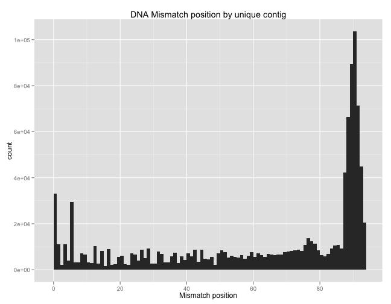 

```r

mismatch_by_count <- function(df) {
    df$mm_set <- gsub(":[^,]+", "", df$Mismatches)
    mm_sets <- ddply(df[, c("mm_set", "Count")], "mm_set", summarise, Count = sum(Count))
    split_row <- function(row) data.frame(pos = as.integer(unlist(strsplit(as.matrix(row[1]), 
        ","))), Count = row[2])
    mm_sets <- ddply(mm_sets[-1, ], "mm_set", split_row)
    mm_sets <- ddply(mm_sets, "pos", summarise, Count = sum(Count))
    return(mm_sets)
}

mm_dna_pos <- mismatch_by_count(dna.subset)

# By counts:
ggplot(mm_dna_pos, aes(x = pos, weight = Count)) + geom_histogram(binwidth = 1) + 
    scale_x_continuous(name = "Mismatch position") + opts(title = "DNA Mismatch position by read counts")
```

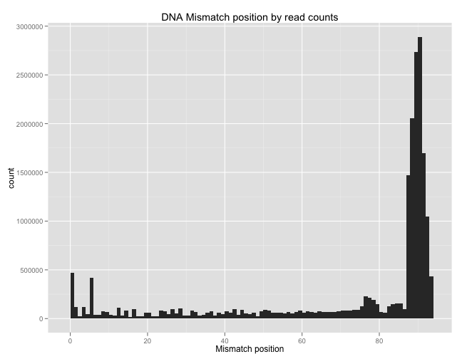 


Woah. There are tons of errors from base 88 onward. Millions and millions of reads have mismatches in this region. Is synthesis that bad towards the end, or is something else amiss? I'm not sure what we should do about it. It's looking more and more like we should throw away RNA/DNA with any mismatches.

Let's look at the RNA. The mismatch position won't be as useful since the offsets are all different, so we'll add the `Offset.L` position for each. 


```r

mismatch_by_count_rna <- function(df) {
    df <- subset(df, Mismatches.len > 0)
    df$mm_set <- gsub(":[^,]+", "", df$Mismatches)
    mm_sets <- ddply(df[, c("mm_set", "Count", "Offset.L")], c("mm_set", "Offset.L"), 
        summarise, Count = sum(Count))
    split_row <- function(row) data.frame(pos = as.integer(unlist(strsplit(row$mm_set, 
        ","))) + row$Offset.L, Count = row$Count)
    mm_sets <- ddply(mm_sets, "mm_set", split_row)
    mm_sets <- ddply(mm_sets, "pos", summarise, Count = sum(Count))
    return(mm_sets)
}

mm_rna_pos <- mismatch_by_count_rna(rna.subset)

# By counts:
ggplot(mm_rna_pos, aes(x = pos, weight = Count)) + geom_histogram(binwidth = 1) + 
    scale_x_continuous(name = "Mismatch position") + opts(title = "RNA Mismatch position by read counts")
```

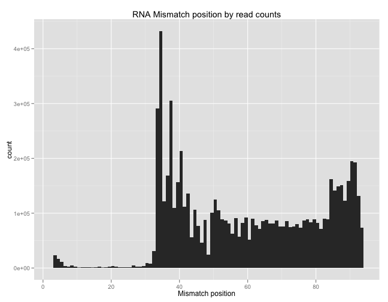 


The RNA mismatch profile is also interesting. There are many mutations in the promoter region (30-40 bases in) and not as many in the 85+ region (though still double the rest of the CDS). 

## Conclusions

We're ready to move on, but there are still some odd things going on, and we might want to revisit this step, depending on how things go. 

1. **14 Pairs of Duplicate Constructs**: 28 constructs were duplicates (14 pairs of 2), so I removed them from the construct library, keeping the `Max Rare` for each pair.

2. **15 Construcs with no DNA reads**: They are all BamA sequences. Interestingly, there are no bad alignments for these 15 either. Just no alignments whatesoever. Even more interestingly, there ARE RNA alignments for all of them. Some unique RNA contigs for these 15 have read counts numbering into the hundreds and two over 1000. 

3. **17 Constructs with no RNA reads**: There were some filtered RNA contigs for those constructs, but they had low read counts and many had high non-zero R-offsets (i.e. they didn't go to end of the sequence). They are all weak promoter constructs, so they are probably just weakly transcribed.

4. **RNA reads are filtered for a variety of reasons**: ~60% are DNA contamination, ~10% have non-zero right offsets, ~30% have a late TSS and the promoter cannot be identified. 

5. **There is a wide range of average mismatch counts per gene**: Almost all the constructs have 78% of their reads from perfect match contigs, 19% from contigs with 1 mismatch, 2% with 2 mismatches, and 1% with 3 mismatches. This holds for RNA and DNA. However, with DNA, per gene, there is an extremely wide range of reads coming from perfect constructs, from 48% to 62%. The same range for RNA sequences is 75% to 81%. 

6. **DNA Mismatches occur predominantly at the end of the CDS**: Number of reads with mismatches at each of the 5-7 bases at the end of the RBS is extreme, about 3 million reads with mismatches per base. In contrast, none of the other positions have mismatches in more than 250,000 reads. This is striking and we should consider its effects.

7. **RNA Mismatches occur predominantly around the end of the Promoter**: Four times the number of mismatches occur 33-40 bases into the constructs, corresponding to the end of the promoters. Could these mismatches be increasing the strengths of the promoters, and increasing the number of reads we see? We could be seeing a similar affect with the DNA above also, although the mechanism is less clear. 


