<link href="http://kevinburke.bitbucket.org/markdowncss/markdown.css" rel="stylesheet"></link>


# Step 04 - Merging Reads and Calculating Levels

## Motivation

Now that we have RNA, DNA, and Protein, we need to merge them into one data frame. We called it ngs in 202, so we'll do the same here. There should only be one DNA and Protein contig per library member, so that will be easy, but there will be multiple RNA contigs owing to different start sites. We will need to summarize the RNA data first before we can merge everything togther.


## Summarize the DNA and RNA Data from individual contigs

We will use ddply to count the total number of reads per RNA, and also pick
the most common start site and the percentage of reads for it. We can discard some of the columns including the Read sequence column and the Offset columns.

> NOTE: For Offset.RBS.Best I am taking the offset of the unique contig with the highest read count, not the RBS Offset with the highest read count (multiple unique contigs might have the same offset). Because it would be more difficult and slower to group contigs by offset to get this one field, I am assuming that the contig with the highest count is also from the RBS offset group with the highest count. 


```r

rna.summary <- ddply(rna.subset, .(Name), summarize, Count.RNA = sum(Count), 
    Count.A = sum(Count.A), Count.B = sum(Count.B), Offset.RBS = sum((Offset.RBS * 
        Count)/sum(Count)), Offset.RBS.Best = Offset.RBS[which.max(Count)], 
    Offset.UniqCount = length(unique(Offset.RBS)), MismatchAvg.RNA = sum((Mismatches.len * 
        Count)/sum(Count)))

dna.summary <- ddply(dna.subset, .(Name), summarize, Count.DNA = sum(Count), 
    Count.A = sum(Count.A), Count.B = sum(Count.B), MismatchAvg.DNA = sum((Mismatches.len * 
        Count)/sum(Count)))
```


> Note: I would like to calculate the best actual TSS by read count and the percentage of reads that have that start site, but that would take an extra step so I'm not doing it right now. I might come back to it if I choose to look more deeply at TSS for the manuscript.

## Merge the DNA, RNA, and Protein Data

First we will merge the DNA and Protein, and then add the RNA. From the protein data we only need the `Bin` data and the `Count` field. 


```r
# first, merge protein and DNA
prot.cols <- c(names(prot.raw)[grepl("Bin", names(prot.raw))], "Count", 
    "Name")
ngs <- merge(dna.summary, prot.raw[, prot.cols], all = T, by = "Name", 
    suffixes = c(".DNA", ".Prot"))

# then, add the RNA
ngs <- merge(ngs, rna.summary, all = T, by = "Name", suffixes = c(".DNA", 
    ".RNA"))

# Add back library columns
ngs <- merge(ngs, lib_seqs, all = T, by = "Name")

# Rename the protein count column to Count.Prot
names(ngs)[names(ngs) == "Count"] <- "Count.Prot"
```


## Calculate RNA Ratio

We calculate the ratio separately for each replicate, then we average them each. We use the read counts for each replicate for RNA and DNA to normalize. 

This code is the same as the 202 analysis, but I've used `log` and `exp` to speed things up so we don't have to use division across every row. 


```r

rtotal.rna.a.203 <- 38074822
rtotal.rna.b.203 <- 27600090
rtotal.dna.a.203 <- 38606554
rtotal.dna.b.203 <- 35788869

# this function comes from the 202 analysis, func_data.R
calc_rna_ratio <- function(df_rna, rna_a_total, rna_b_total, dna_a_total, 
    dna_b_total, suffix = "") {
    
    suf <- function(str) paste(str, suffix, sep = "")
    gsuf <- function(str) get(paste(str, suffix, sep = ""), pos = df_rna)
    
    df_rna[suf("RNA.A")] <- exp(log(gsuf("Count.A.RNA")/rna_a_total) - log(gsuf("Count.A.DNA")/dna_a_total))
    df_rna[suf("RNA.B")] <- exp(log(gsuf("Count.B.RNA")/rna_b_total) - log(gsuf("Count.A.DNA")/dna_b_total))
    df_rna[suf("RNA")] <- (gsuf("RNA.A") + gsuf("RNA.B")/2)
    return(df_rna)
}

ngs <- calc_rna_ratio(ngs, rtotal.rna.a.203, rtotal.rna.b.203, rtotal.dna.a.203, 
    rtotal.dna.b.203)
```


## Calculate Protein Scores

In order to calculate the scores, we first need to normalize by the numbers of cells sorted into each bin. 

There are two functions here. The first calculated the adjusted the normalized per-bin per-construct read contribution, since each bin had a different number of cells and a different number of reads. The next function uses those normalized bin counts and the average fluorescence level to calculate the protein level. Both of these functions come from the 202 analysis.


```r
# Percentages of cells sorted into each bin
prot.bin_pcts <- c(37.93333333, 9.266666667, 10.86666667, 10.16666667, 
    7.666666667, 5.8, 4.533333333, 3.566666667, 2.833333333, 2.266666667, 1.733333333, 
    3.2)

# Bin Values for fluorescence ratio sorting as defined in FACSDiva
bin_breaks <- c(0, 1250, 2027, 3287, 5331, 8645, 14019, 22735, 36870, 
    59791, 96963, 157243, 255000)


# calculates adjusted scores from bin means and read per bin percentages
get_protein_level <- function(ngs_df, bin_pcts, bin_breaks) {
    # get mean value for each bin
    bin_means <- (bin_breaks[2:length(bin_breaks)] - bin_breaks[1:length(bin_breaks) - 
        1])/2 + bin_breaks[1:length(bin_breaks) - 1]
    contrib_per_bin <- get_adj_bins(ngs_df, bin_pcts, bin_breaks)
    return(exp(colSums(contrib_per_bin * log(bin_means))))
}

# calculates normalized per-bin per-construct read contribution
get_adj_bins <- function(ngs_df, bin_pcts, bin_breaks) {
    # get total number of reads per bin
    bin_sums <- colSums(ngs_df[, paste("Bin", c(1:12), sep = ".")], na.rm = TRUE)
    # get percentage of reads per construct that fall into each bin
    read_pcts <- t(ngs_df[, paste("Bin", c(1:12), sep = ".")])/bin_sums * bin_pcts
    contrib_per_bin <- t(t(read_pcts)/colSums(read_pcts))
    return(contrib_per_bin)
}

ngs$Prot <- get_protein_level(ngs, prot.bin_pcts, bin_breaks)
```


***

## Exploratory Plots

Let's quickly examine some of the data and make sure it looks ready to play with.

We can only look at categorical info and RNA / DNA / Protein levels. It will be interesting to explore other characteristics of each constructs, like codon usage, amino acid sequence, secondary structure, etc. I will try to calculate these in python in step 05, but for now, let's just look at the known categories and see if anything pops out. 

### DNA levels per Gene 

First, let's look at DNA levels. Here we plot each gene on the Y axis sorted by highest RNA expression at the top, the promoter as a shape, the RBS as a color, and the DNA read count on the X axis. 


```r
ggplot(ngs, aes(x = log10(Count.DNA), y = reorder(Gene, log10(RNA), 
    mean, na.rm = TRUE), colour = RBS, shape = Promoter)) + geom_jitter(size = 2, 
    position = position_jitter(height = 0.3, width = 0)) + opts(axis.text.y = theme_text(size = 8), 
    title = "DNA count per gene/promoter")
```

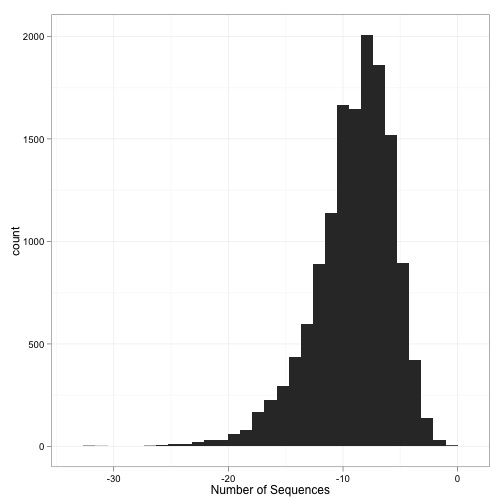 


There are fewer DNA reads for the strong RBS/strong Promoter combination (purple circles), and some genes in particular that are outliers as far as DNA read count. DNA read count has a pretty good correlation to cellular growth rate, so cells with these sequences could have a growth phenotype. Genes with few DNA reads include SecA, FabD, and BamA. 15 BamA sequences had no DNA, and are not shown in this plot.

There are a few other outliers, like the weak promoter DnaE with WT RBS. BamD also has two constructs with few DNA sequences from weak RBSs. 

Some genes, like KdsB, lepB, csrA, just appear to have a lot of DNA across all other dimensions. I wonder if the leader peptide itself can somehow have an effect on growth phenotype?

### Promoter/RBS RNA Histograms

Next, let's look at the RNA levels across all of our dimensions:


```r

multiplot(ggplot(ngs, aes(x = log10(RNA), fill = Promoter)) + geom_density(alpha = 0.5) + 
    opts(title = "RNA Levels between promoters"), ggplot(ngs, aes(x = log10(RNA), 
    fill = RBS)) + geom_density(alpha = 0.5) + opts(title = "RNA Levels between RBS"), 
    cols = 1)
```

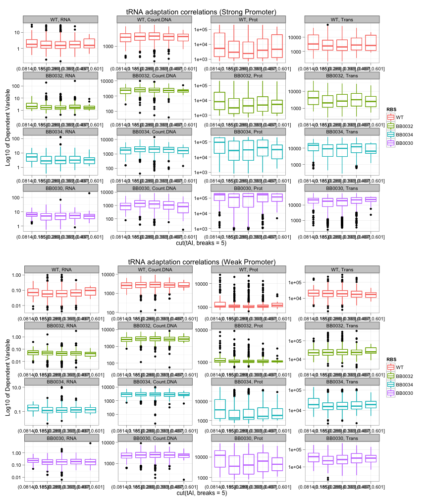 


```r
ggplot(ngs, aes(x = log10(RNA), fill = RBS)) + geom_density(alpha = 0.5) + 
    facet_grid(. ~ Promoter, scales = "free_x", labeller = label_both)
```

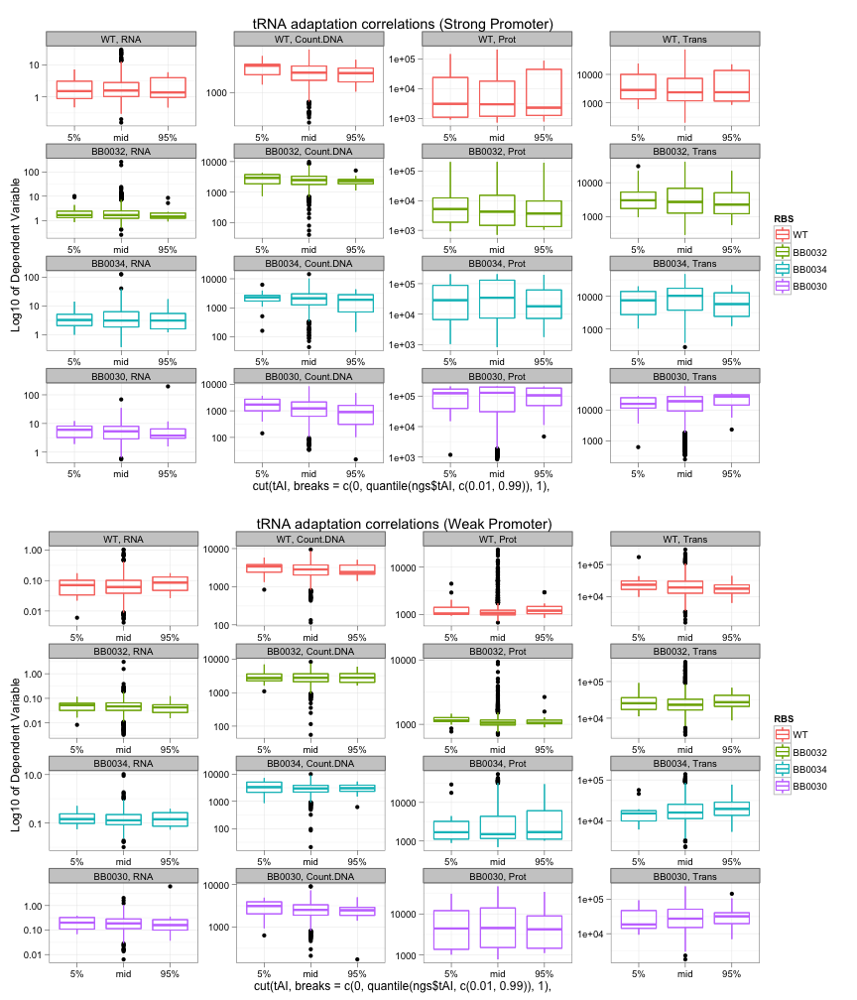 


* The two promoters have very different RNA levels, as you might expect.
* The four RBSes have somewhat different but less profound effects on RNA, as we saw in 202. WT/32 is the weakest, then 34, then 30. WT RBSs are generally weaker than 32 under the strong promoter, but stronger than 32 under the weak promoter.
* The distributions are 'knobby', probably corresponding to differences per CDS. The 'knobbiness' is more distinct under the strong promoter.

### Gene RNA Boxplot Plots

Let's look at the differences per gene per promoter. Here I'm sorting the genes (along the X axis) by increasing RNA levels. 


```r
ggplot(ngs, aes(y = log10(RNA), x = reorder(Gene, log10(RNA), mean, 
    na.rm = TRUE), colour = Promoter)) + geom_boxplot(outlier.size = 0.5, aes(outlier.colour = Promoter)) + 
    opts(axis.text.x = theme_text(angle = -90, size = 4), title = "RNA levels per gene/promoter")
```

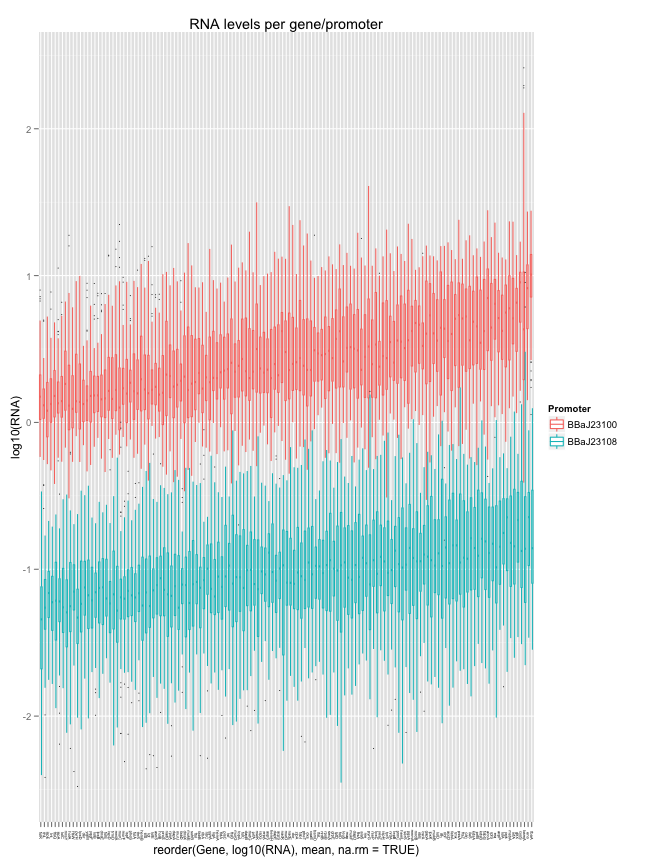 


Looking at only constructs with the stronger promoter, let's look at RBS differences. I'll color each RBS differently, and display each gene along the Y axis.


```r
ggplot(subset(ngs, Promoter == "BBaJ23100"), aes(x = log10(RNA), 
    y = reorder(Gene, log10(RNA), mean, na.rm = TRUE), colour = RBS)) + geom_jitter(size = 1, 
    position = position_jitter(height = 0.3, width = 0)) + opts(axis.text.y = theme_text(size = 9), 
    title = "RNA levels per gene/RBS for BBaJ23100")
```

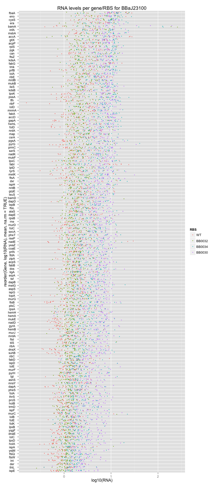 


* The BamA gene has a very wide distribution. It is also missing some DNA reads. Low DNA in the ones that are present could be the reason why we see such high RNA levels.
* The WT RBS is usually weaker than the designed ones, but not for all genes. For FabI and AccA, for instance, it is the strongest. It would be interesting to rate the WT RBSs by their Shine-Dalgarno strength, or through some tool like the RBS calculator. 

### RNA by Designed CDS Type 

Finally, let's color by CDS type and use RBS for shape. This will be kind of a mess if we don't split the delta-Gs and the min/max codons. 


```r
CDS.dG <- with(ngs, levels(CDS.type)[grepl('G',levels(CDS.type))])

multiplot(
    ggplot(subset(ngs, CDS.type %in% CDS.dG), 
        aes(x=log10(RNA), y=reorder(Gene, log10(RNA), mean, na.rm=TRUE),
            colour=(as.integer(CDS.type)), shape=RBS)) +
    geom_jitter(size=1.5, position=position_jitter(height = .3, width=0)) + 
    facet_grid(. ~ Promoter, scales='free_x', labeller = label_both) +
    scale_colour_gradient2(midpoint=5, 
        name='Secondary Structure (1-10, low to high)',
        low='darkblue', mid='beige', high='firebrick4') +
    opts(axis.text.y=theme_text(size=9),
        title='RNA levels per gene/RBS/CDS - Designed Secondary Structure'),
    
    ggplot(subset(ngs, !(CDS.type %in% CDS.dG)), 
        aes(x=log10(RNA), y=reorder(Gene, log10(RNA), mean, na.rm=TRUE),
            colour=CDS.type, shape=RBS)) +
    geom_jitter(size=1.5, position=position_jitter(height = .3, width=0)) + 
    facet_grid(. ~ Promoter, scales='free_x', labeller = label_both) +
    opts(axis.text.y=theme_text(size=9),
        title='RNA levels per gene/RBS/CDS - WT, Min/Max Codon Usage'),
    cols=1)
```

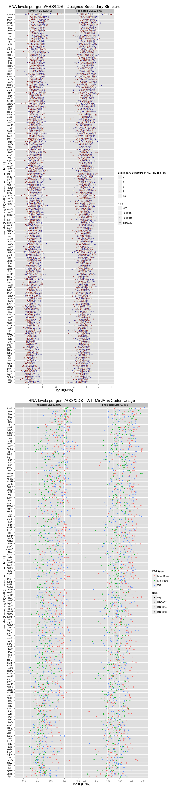 


There seems to be an effect. 

* In the first plot, the increasing secondary structure (red) decreases RNA levels.
* In the second plot, the Green/Blue/Red order of points shows that RNA levels increase from Min Rare, Max Rare, Wild Type.

Finally, let's make boxplots across the 10 CDS types. 


```r
ggplot(ngs, aes(x = CDS.type, y = log10(RNA))) + geom_boxplot() + 
    facet_grid(Promoter ~ ., scales = "free", labeller = label_both) + opts(axis.text.y = theme_text(size = 9), 
    title = "RNA levels by CDS Type")
```

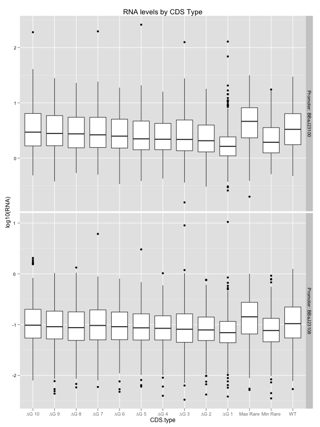 


The effect is visible but weak across the deltaG variants, but strong between min/max/WT. 

### RNA TSS across RBS / Promoter / Gene

Next, let's look at the RNA Transcription Start Sites across all of our dimensions:


```r

multiplot(ggplot(ngs, aes(x = Offset.RBS, fill = Promoter)) + geom_density(alpha = 0.5) + 
    scale_x_continuous(limits = c(-20, -3)) + opts(title = "RNA TSS Position between promoters"), 
    ggplot(subset(ngs, Promoter == "BBaJ23100"), aes(x = Offset.RBS, fill = RBS)) + 
        geom_density(alpha = 0.5) + scale_x_continuous(limits = c(-10, -3)) + 
        opts(title = "RNA TSS Position by RBS (Strong Promoter)"), ggplot(subset(ngs, 
        Promoter == "BBaJ23108"), aes(x = Offset.RBS, fill = RBS)) + geom_density(alpha = 0.5) + 
        scale_x_continuous(limits = c(-20, -3)) + opts(title = "RNA TSS Position by RBS (Weak promoter)"), 
    cols = 1)
```

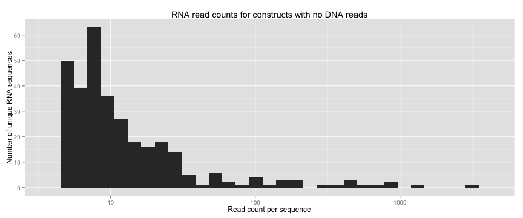 


This measure of RNA Transcription Start Site is relative to the barcode/RBS junction so that -5 is the edge of the promoter. It is calculated as the average RNA offset per unique contig, weighted by read count of each contig.

Are there differences in RNA offset between genes? This should be straightforward to check:


```r
ggplot(ngs, aes(x = Offset.RBS, y = reorder(Gene, log10(Count.RNA), 
    mean, na.rm = TRUE), colour = RBS, shape = Promoter)) + geom_jitter(size = 2, 
    position = position_jitter(height = 0.3, width = 0)) + facet_grid(. ~ Promoter, 
    scales = "free_x", labeller = label_both) + opts(axis.text.y = theme_text(size = 8), 
    title = "RNA TSS position by gene/promoter/RBS")
```

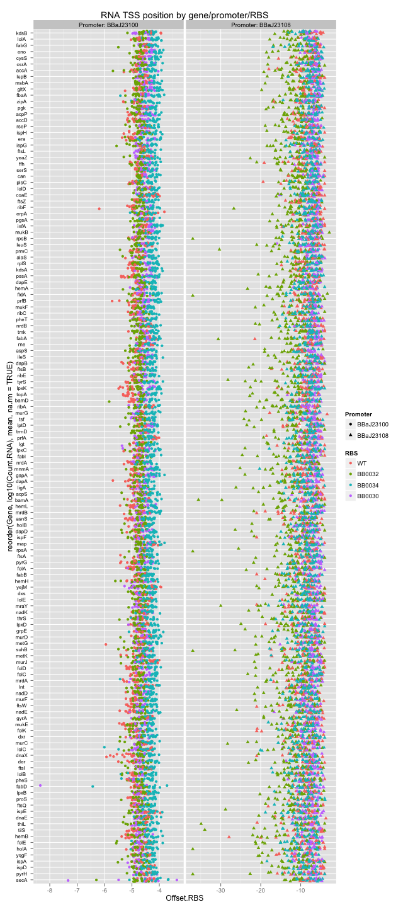 


This plot is really interesting. Note that the X axis scales are different for the two promoters.

* Generally, weaker RBS and weaker Promoter means earlier average TSS. 
* There are no large gene-specific effects (the gene axis is sorted on RNA read count here; I saw no trend for RNA/Protein level). 

* There are some interesting things going on for a few of the wild-type RBSs under strong promoters, and a few outliers. 

* Those outliers (blue/purple/green at bottom, under strong expression) might also just have very few RNA reads and so the earlier starting transcripts are over-represented. It could also mean that those constructs have a proper start site that begins later than can be determined via the 5-base barcode. 

> Note: It might make sense at some point to go back and see if, for any Gene/CDS.type/RBS, there are a preponderance of reads that cannot be aligned to an individual promoter. It might be worth noting in our analyses later.

Finally, I want to check if there is a strong correlation between the offset
position and the number of unique start positions or the average mismatch count. 


```r
ggplot(ngs, aes(x = Offset.RBS, y = reorder(Gene, log10(Count.RNA), 
    mean, na.rm = TRUE), colour = cut(Offset.UniqCount, c(0, 1, 3, 5, Inf), 
    labels = c("1", "2-3", "4-5", ">5")), shape = RBS)) + geom_jitter(size = 2, 
    position = position_jitter(height = 0.3, width = 0)) + scale_colour_hue(name = "Number of unique TSSs") + 
    facet_grid(. ~ Promoter, scales = "free_x", labeller = label_both) + opts(axis.text.y = theme_text(size = 8), 
    title = "RNA TSS position by gene/promoter/RBS")
```

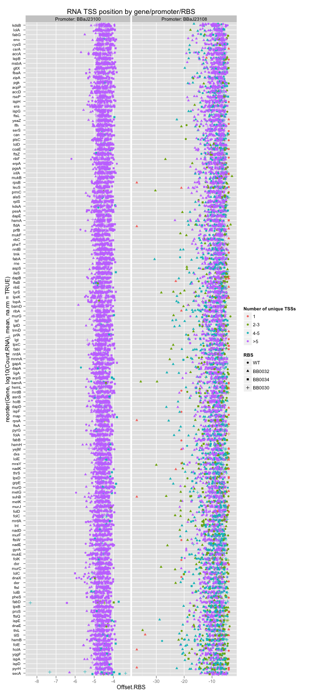 


It does look like some, but not all of the early TSSs are due to constructs with few reads and only a few unique TSSs. 

There is also a very weak positive correlation between RNA level and TSS start location; constructs with later TSSs seem to have more RNA expression. I did not see a correlation w/ Protein levels. 

### Protein levels 

Next, let's look at the Protein levels across all of our dimensions:


```r
multiplot(ggplot(ngs, aes(x = log10(Prot), fill = Promoter)) + geom_density(alpha = 0.5) + 
    opts(title = "Protein Levels between promoters"), ggplot(ngs, aes(x = log10(Prot), 
    fill = RBS)) + geom_density(alpha = 0.5) + opts(title = "Protein Levels between RBS"), 
    cols = 1)
```

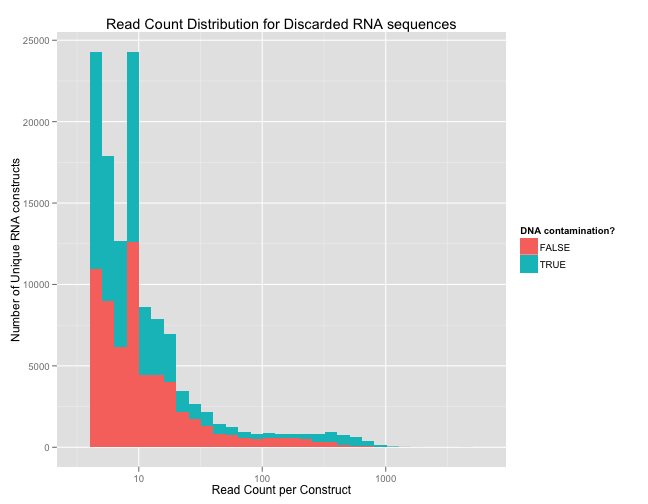 


There's a lot to unpack here. Let's keep going.


```r
ggplot(ngs, aes(x = log10(Prot), fill = RBS)) + geom_density(alpha = 0.5) + 
    facet_grid(Promoter ~ ., scales = "free_y", labeller = label_both) + opts(title = "Protein Levels between RBS/Promoter")
```

 


For the weak promoter, a lot of expression is below the quantifiable range. The 'knobbiness' of the WT RBSes are quite interesting also. 


```r
ggplot(ngs, aes(y = log10(Prot), x = reorder(Gene, log10(Prot), mean, 
    na.rm = TRUE), color = Promoter)) + geom_boxplot(outlier.size = 0.5, aes(outlier.colour = Promoter)) + 
    opts(axis.text.x = theme_text(angle = -90, size = 4), title = "Protein levels per gene/promoter")
```

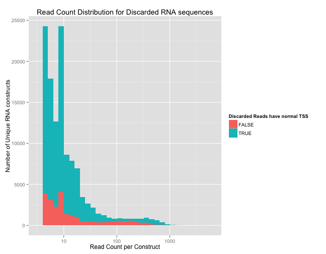 


Here we are looking at the expression range of each gene under each promoter (red/blue). There is quite a wide range and a lot of overlap. Also a lot of values above and below the quantifiable range.

Now let's examine the RBS differences for the strong promoter only:


```r
ggplot(subset(ngs, Promoter == "BBaJ23100"), aes(x = log10(Prot), 
    y = reorder(Gene, log10(Prot), mean, na.rm = TRUE), colour = RBS)) + geom_jitter(size = 1, 
    position = position_jitter(height = 0.3, width = 0)) + opts(axis.text.y = theme_text(size = 9), 
    title = "Protein levels per gene/RBS for BBaJ23100")
```

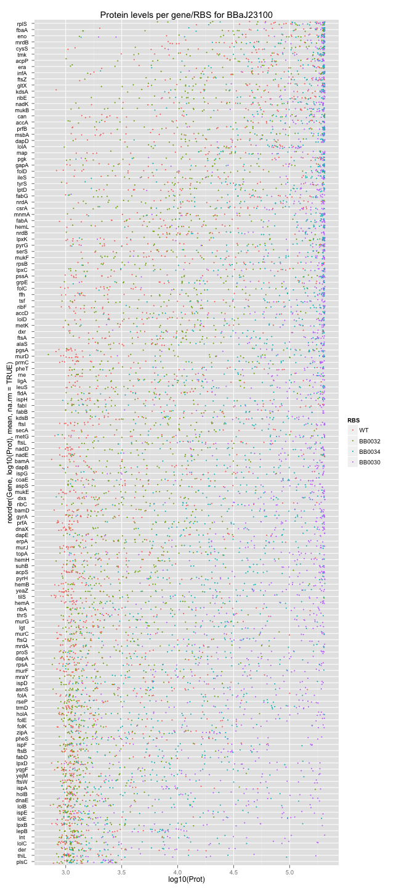 


Quite a stark difference based on RBS, which we expect. 

## Protein by Designed CDS Type


```r
CDS.dG <- with(ngs, levels(CDS.type)[grepl('G',levels(CDS.type))])

multiplot(
    ggplot(subset(ngs, CDS.type %in% CDS.dG), 
        aes(x=log10(Prot), y=reorder(Gene, log10(Prot), mean, na.rm=TRUE),
            colour=(as.integer(CDS.type)), shape=RBS)) +
    geom_jitter(size=1.5, position=position_jitter(height = .3, width=0)) + 
    facet_grid(. ~ Promoter, scales='free_x', labeller = label_both) +
    scale_colour_gradient2(midpoint=5, 
        name='Secondary Structure (1-10, low to high)',
        low='darkblue', mid='beige', high='firebrick4') +
    opts(axis.text.y=theme_text(size=9),
        title='Protein levels per gene/RBS/CDS - Designed Secondary Structure'),
    
    ggplot(subset(ngs, !(CDS.type %in% CDS.dG)), 
        aes(x=log10(Prot), y=reorder(Gene, log10(Prot), mean, na.rm=TRUE),
            colour=CDS.type, shape=RBS)) +
    geom_jitter(size=1.5, position=position_jitter(height = .3, width=0)) + 
    facet_grid(. ~ Promoter, scales='free_x', labeller = label_both) +
    opts(axis.text.y=theme_text(size=9),
        title='Protein levels per gene/RBS/CDS - WT, Min/Max Codon Usage'),
    cols=1)
```

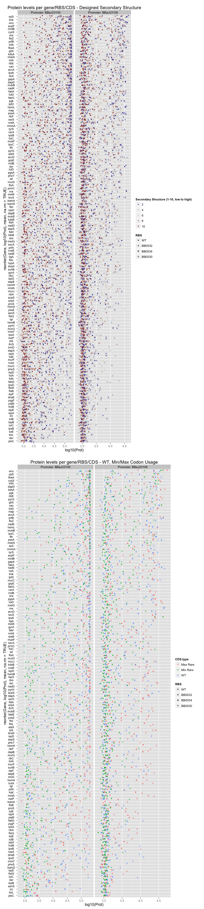 


```r
ggplot(ngs, aes(x = CDS.type, y = log10(Prot))) + geom_boxplot() + 
    facet_grid(Promoter ~ ., scales = "free", labeller = label_both) + opts(axis.text.y = theme_text(size = 9), 
    title = "Protein levels by CDS type")
```

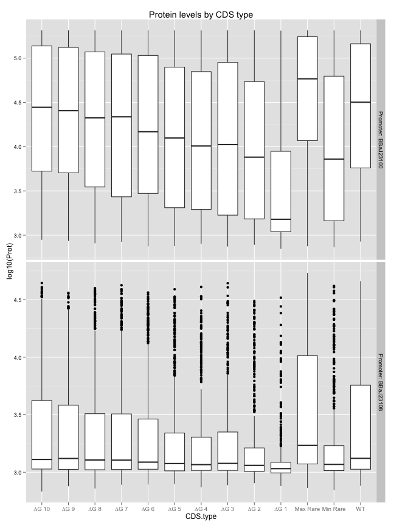 


### Translation Efficiency

Dividing Protein level by RNA level gives Translation efficiency, a measure of the number of proteins generated per RNA. 


```r
ngs$Trans <- ngs$Prot/ngs$RNA
```


>TODO: Some plots exploring Translation Efficiency

### Conclusions 

>TODO: To be written...


