<link href="http://kevinburke.bitbucket.org/markdowncss/markdown.css" rel="stylesheet"></link>


# Step 05 - Looking at amino acid and codon usage

We will split up the coding sequences into codons and look at codon counts. We can then use individual codon counts or various related metrics (tAI, CAI, amino acid charge, etc) to examine the effects on DNA, RNA, and protein levels. 

## Splitting each CDS into codon frequencies. 


```r

# Let's get codon names and AAs from this table:
codon.txt <- read.table(file = paste(getwd(), "/data/codon_usage.txt", 
    sep = ""), sep = "\t", header = T)[1:64, 1:5]

# remove the empty level, convert U to T
codon.txt$Codon <- factor(gsub("U", "T", codon.txt$Codon))

# name the rows by codon name for easy lookup
rownames(codon.txt) <- codon.txt$Codon

get_codon_freq <- function(seq) {
    seq <- as.character(seq[1, "CDS.seq"])
    codons <- factor(unlist(strsplit(seq, "(?<=\\G...)", perl = T)), levels = levels(codon.txt$Codon))
    codons <- as.data.frame(table(codons))
    names(codons) <- c("Codon", "Freq")
    return(codons)
}

codon.freq <- ddply(lib_seqs, .(CDS.seq), get_codon_freq)
codon.freq <- merge(codon.freq, unique(lib_seqs[, c("CDS.seq", "Gene")]), 
    by = "CDS.seq")
codon.totals <- cast(codon.freq, Codon ~ ., value = .(Freq), function(x) sum(as.integer(x)))
codon.totals <- cbind(codon.totals, matrix(unlist(strsplit(as.character(codon.totals$Codon), 
    split = ""), recursive = F), ncol = 3, byrow = T))
names(codon.totals) <- c("Codon", "Freq", "First", "Second", "Third")

# Add gene count - how many genes this codon appears in
codon.totals$Count.Gene <- rowSums(cast(codon.freq[, c(1, 2, 4, 3)], 
    Codon ~ Gene, sum) > 0, na.rm = T)

# merge, make display column
codon.totals <- merge(codon.totals, codon.txt, by = "Codon")
codon.totals$Display <- with(codon.totals, paste(Codon, " (", AA, 
    ") - ", Count.Gene, sep = ""))
```


## Codon Frequency Correlations

Here is a simple table with the codon frequency in the whole library:


It looks like there are enough instances of most of these codons to be able to look at correlation of their presence with 

### Codon Frequency vs. Protein Level

Now let's merge `codon.freq` with the `ngs` dataframe so that we can see if there is a correlation between the frequency of any of the codons and the Protein or (unlikely) RNA levels. 

We should also see how many unique peptides are represented by each amino acid, so we'll put that number in parenthesis.


```r
get_codon_corr <- function(codon, dep = "Prot", df = ngs) {
    cdata <- merge(subset(codon.freq, Codon == codon), df, all.x = T)
    csumm <- summary(lm(Freq ~ get(dep), data = cdata))
    cpearson <- with(subset(cdata, !is.na(get(dep))), cor.test(get(dep), Freq))
    return(data.frame(Codon = codon, lm.r.squared = csumm$r.squared, lm.slope = csumm$coefficients[2, 
        1], lm.p.value = csumm$coefficients[2, 4], pson = cpearson$estimate, 
        pson.p.value = cpearson$p.value))
}

codon.prot <- merge(codon.totals, do.call(rbind, lapply(codon.totals$Codon, 
    get_codon_corr)), by = "Codon", all = T)

ggplot(codon.prot, aes(x = 1, y = Third, fill = lm.slope, label = Display)) + 
    geom_tile() + facet_grid(First ~ Second, labeller = label_both) + geom_text(aes(colour = lm.p.value < 
    0.05/61)) + scale_colour_manual(values = c("grey60", "white")) + scale_fill_gradient2(mid = "gray90", 
    low = "darkred", high = "blue") + opts(title = "Linear Regression Slope of Codon Freq v. Protein Level")
```


```r

ggplot(codon.prot, aes(x = 1, y = Third, fill = pson, label = Display)) + 
    geom_tile() + facet_grid(First ~ Second, labeller = label_both) + geom_text(aes(colour = pson.p.value < 
    0.05/61)) + scale_colour_manual(values = c("grey60", "white")) + scale_fill_gradient2(mid = "gray90", 
    low = "darkred", high = "blue") + opts(title = "Codon Freq Pearson R w/ Protein Level")
```


Quite a few amino acids seem to have a correlation with Protein level. Light-grey text means the pearson fell below the threshold of significance (0.05/61) corrected for the number of codons. (This is how Pilpel's Genome Biology paper does it in Figure 5)


### Codon Frequency vs. RNA Level

We should see no correlation with RNA, so let's check:


```r

codon.rna <- merge(codon.totals, do.call(rbind, lapply(codon.totals$Codon, 
    get_codon_corr, dep = "RNA")), by = "Codon", all = T)

ggplot(codon.rna, aes(x = 1, y = Third, fill = lm.slope, label = Display)) + 
    geom_tile() + facet_grid(First ~ Second, labeller = label_both) + geom_text(aes(colour = lm.p.value < 
    0.05/61)) + scale_colour_manual(values = c("grey60", "white")) + scale_fill_gradient2(mid = "gray90", 
    low = "darkred", high = "blue") + opts(title = "Linear Regression Slope of Codon Freq v. RNA Level")
```

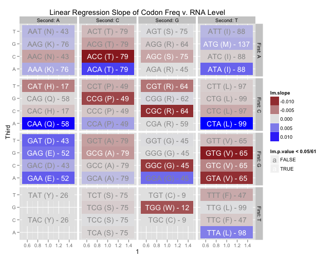 

```r

ggplot(codon.rna, aes(x = 1, y = Third, fill = pson, label = Display)) + 
    geom_tile() + facet_grid(First ~ Second, labeller = label_both) + geom_text(aes(colour = pson.p.value < 
    0.05/61)) + scale_colour_manual(values = c("grey60", "white")) + scale_fill_gradient2(mid = "gray90", 
    low = "darkred", high = "blue") + opts(title = "Codon Freq Pearson R w/ RNA Level")
```

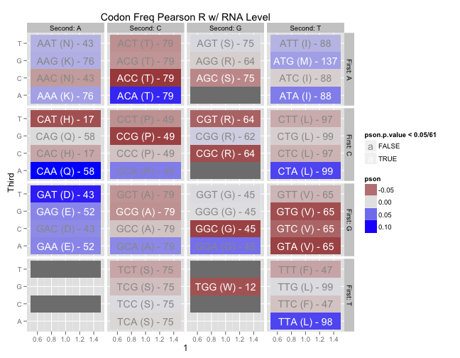 


This is interesting. It looks similar to the Protein level. However, I'm not sure I believe it. Codons should not affect RNA production, unless it's somehow tied into either secondary structure, or perhaps growth rate. However, the growth rate term should be removed since we divide by DNA. Speaking of which, what about DNA?


```r

codon.dna <- merge(codon.totals, do.call(rbind, lapply(codon.totals$Codon, 
    get_codon_corr, dep = "Count.DNA")), by = "Codon", all = T)

ggplot(codon.dna, aes(x = 1, y = Third, fill = lm.slope, label = Display)) + 
    geom_tile() + facet_grid(First ~ Second, labeller = label_both) + geom_text(aes(colour = lm.p.value < 
    0.05/61)) + scale_colour_manual(values = c("grey60", "white")) + scale_fill_gradient2(mid = "gray90", 
    low = "darkred", high = "blue") + opts(title = "Linear Regression Slope of Codon Freq v. DNA Level")
```

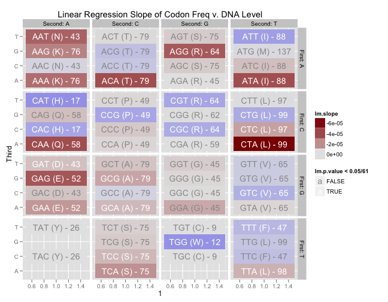 

```r

ggplot(codon.dna, aes(x = 1, y = Third, fill = pson, label = Display)) + 
    geom_tile() + facet_grid(First ~ Second, labeller = label_both) + geom_text(aes(colour = pson.p.value < 
    0.05/61)) + scale_colour_manual(values = c("grey60", "white")) + scale_fill_gradient2(mid = "gray90", 
    low = "darkred", high = "blue") + opts(title = "Codon Freq Pearson R w/ DNA Level")
```

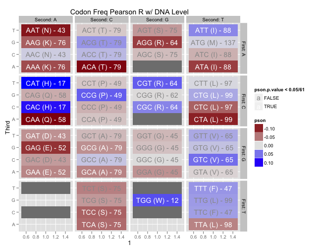 


These plots are somewhat comparable to the data (Fig. 5) in The 2011 Genome Biology paper by Navon and Pilpel:

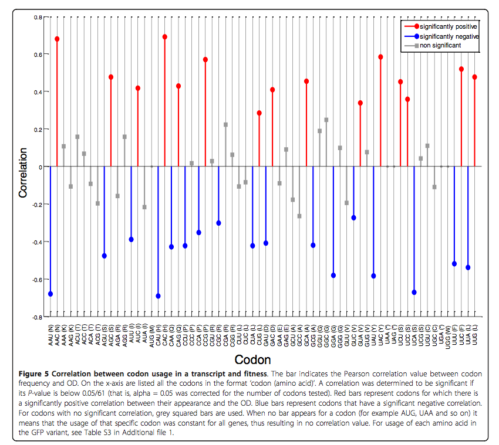


OK, so this is an interesting effect. Finally, what if we look at the translation efficiency, Protein / RNA?

### Codon Frequency vs. Translation Efficiency


```r

codon.teff <- merge(codon.totals, do.call(rbind, lapply(codon.totals$Codon, 
    get_codon_corr, dep = "Trans", df = subset(ngs, Promoter = "BBaJ23100"))), 
    by = "Codon", all = T)

ggplot(codon.teff, aes(x = 1, y = Third, fill = lm.slope, label = Display)) + 
    geom_tile() + facet_grid(First ~ Second, labeller = label_both) + geom_text(aes(colour = lm.p.value < 
    0.05/61)) + scale_colour_manual(values = c("grey60", "white")) + scale_fill_gradient2(mid = "gray90", 
    low = "darkred", high = "blue") + opts(title = "Linear Regression of Codon Freq v. Translation Efficiency")
```

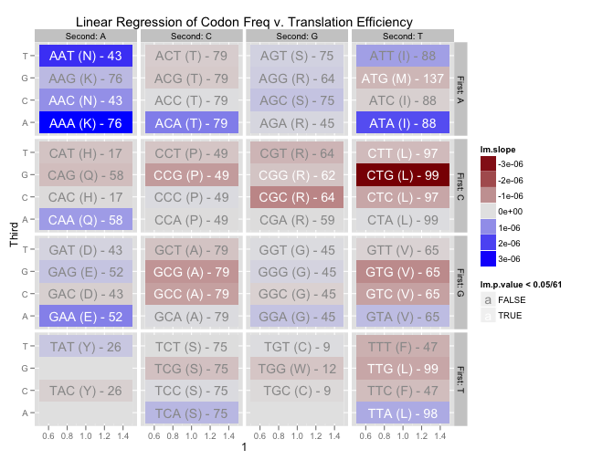 

```r

ggplot(codon.teff, aes(x = 1, y = Third, fill = pson, label = Display)) + 
    geom_tile() + facet_grid(First ~ Second, labeller = label_both) + geom_text(aes(colour = pson.p.value < 
    0.05/61)) + scale_colour_manual(values = c("grey60", "white")) + scale_fill_gradient2(mid = "gray90", 
    low = "darkred", high = "blue") + opts(title = "Codon Freq Pearson R w/ Translation Efficiency")
```

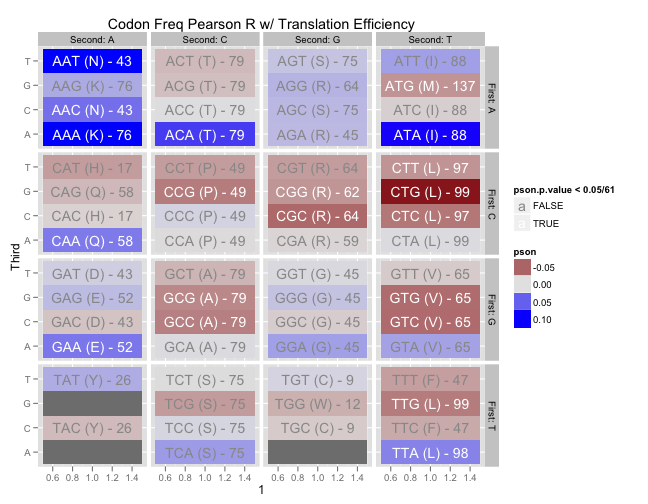 


### Codon Usage Correlation in Strong vs. Weak Expression 


```r

codon.teff_w <- merge(codon.totals, do.call(rbind, lapply(codon.totals$Codon, 
    get_codon_corr, dep = "Trans", df = subset(ngs, Promoter == "BBaJ23108"))), 
    by = "Codon", all = T)
codon.teff_w$Promoter <- "Weak"

codon.teff_s <- merge(codon.totals, do.call(rbind, lapply(codon.totals$Codon, 
    get_codon_corr, dep = "Trans", df = subset(ngs, Promoter == "BBaJ23100"))), 
    by = "Codon", all = T)
codon.teff_s$Promoter <- "Strong"

codon.teff_promo <- rbind(codon.teff_w, codon.teff_s)

names(codon.teff_promo)
```


```
##  [1] "Codon"        "Freq"         "First"        "Second"      
##  [5] "Third"        "Count.Gene"   "Wobble"       "Anticodon"   
##  [9] "AA"           "Freq.Genome"  "Display"      "lm.r.squared"
## [13] "lm.slope"     "lm.p.value"   "pson"         "pson.p.value"
## [17] "Promoter"    
```


```r

ggplot(codon.teff_promo, aes(x = Promoter, y = Third, fill = lm.slope, 
    label = Display)) + geom_tile() + facet_grid(First ~ Second, labeller = label_both) + 
    geom_text(aes(colour = lm.p.value < 0.05/61), size = 4) + scale_colour_manual(values = c("grey60", 
    "white")) + scale_fill_gradient2(mid = "gray90", low = "darkred", high = "blue") + 
    opts(title = paste("Linear Regression Slope of Codon Freq v.", "Translation Efficiency"))
```

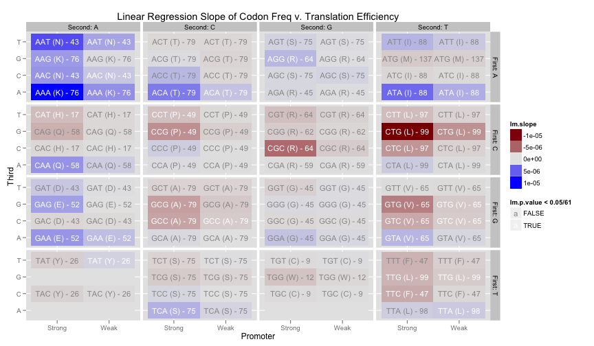 

```r

ggplot(codon.teff_promo, aes(x = Promoter, y = Third, fill = pson, 
    label = Display)) + geom_tile() + facet_grid(First ~ Second, labeller = label_both) + 
    geom_text(aes(colour = pson.p.value < 0.05/61), size = 4) + scale_colour_manual(values = c("grey60", 
    "white")) + scale_fill_gradient2(mid = "gray90", low = "darkred", high = "blue") + 
    opts(title = "Codon Freq Pearson R w/ Translation Efficiency")
```

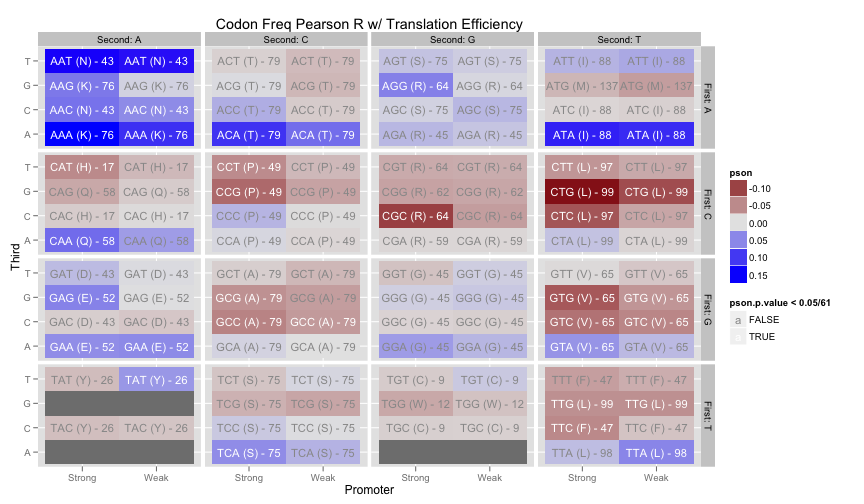 


So we see a stronger slope with the strong promoter, but we see significant effects for both. Let's look at the individual points for some of these and see what these colors are representing:


```r

codon.example_codons <- c("AAA", "CTT", "ATT", "AAC", "CTG", "ATG", 
    "AAG", "CTC", "ATC", "AAT", "CTA", "ATA")

# codon.example_codons <- c('AAA','AAC','AAG','AAT',
# 'CTT','CTG','CTC','CTA', 'ATT','ATG','ATC','ATA')


codon.example_data <- merge(unique(subset(codon.freq, Codon %in% 
    codon.example_codons)), ngs, by = c("CDS.seq", "Gene"))

codon.example_data$Codon <- factor(codon.example_data$Codon, levels = codon.example_codons)

# Jitter plots
ggplot(codon.example_data, aes(x = factor(Freq), y = log(Prot), color = rev(Promoter))) + 
    geom_jitter(alpha = 0.3, position = position_jitter(height = 0)) + facet_wrap(~Codon, 
    ncol = 3, scale = "free_x")
```

 

```r

# Violin plots
ggplot(subset(codon.example_data, Promoter == "BBaJ23100"), aes(x = factor(Freq), 
    y = log(Prot))) + geom_violin() + opts(title = "Violin Density plots for Strong Promoter") + 
    facet_wrap(~Codon, ncol = 3, scale = "free_x")
```

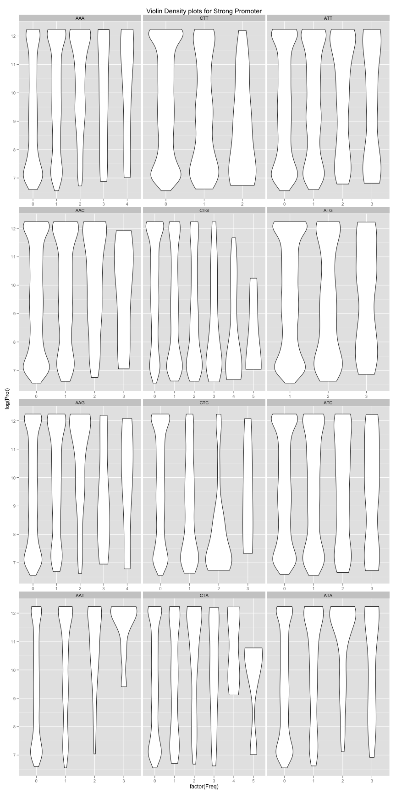 


These plots are all interesting, but I'm not sure I believe what's going on. It makes me realize that what we want is not the expression per instance of the codon, but expression per instance normalized to genes with the same number/identity of amino acids that might be more interesting/useful. Pilpel could do it this way in his analysis because he was looking at GFP, which had the same amino acids across each variant.

## Normalized Codon Expression per Amino Acid

For instance, for AAA, Freq=4 should be the translation level for genes featuring four AAA (K)s, relative to other genes also containing four Ks, but not necessarily all AAA. I might not have enough data to do this, but I will try it anyway. 

I think I can do this with `ddply`. 


```r

get_aa_freq <- function(seq) {
    seq <- as.character(seq[1, "CDS.seq"])
    codons <- factor(unlist(strsplit(seq, "(?<=\\G...)", perl = T)), levels = levels(codon.txt$Codon))
    codons <- as.data.frame(table(codons))
    names(codons) <- c("Codon", "Freq")
    aa <- ddply(merge(codons, codon.txt[, c("Codon", "AA")]), "AA", summarize, 
        Freq = sum(Freq))
    return(aa)
}

# generate an amino acid per-gene frequency table and total counts table
aa.freq <- ddply(lib_seqs, .(CDS.seq), get_aa_freq)
aa.freq <- merge(aa.freq, unique(lib_seqs[, c("CDS.seq", "Gene")]), 
    by = "CDS.seq")
aa.totals <- cast(aa.freq, AA ~ ., value = .(Freq), function(x) sum(as.integer(x)))
names(aa.totals) <- c("AA", "Freq.AA")

# merge with codon total counts, get percentages
aa.codon.totals <- merge(aa.totals, codon.totals, by = "AA")
aa.codon.totals$Codon.Pct.Freq <- with(aa.codon.totals, Freq/Freq.AA)
```


How many times does each amino acid appear per gene?


```r
# get aa by gene counts
aa.by_gene <- ddply(aa.freq, c("Gene", "AA"), summarize, Freq = mean(Freq))
aa.by_gene$Freq.Factor <- as.factor(aa.by_gene$Freq)

aa.gene_table <- with(aa.by_gene, table(AA, Freq.Factor))
print(xtable(aa.gene_table), type = "html")
```

<!-- html table generated in R 2.14.1 by xtable 1.7-0 package -->
<!-- Wed Oct 24 16:31:18 2012 -->
<TABLE border=1>
<TR> <TH>  </TH> <TH> 0 </TH> <TH> 1 </TH> <TH> 2 </TH> <TH> 3 </TH> <TH> 4 </TH> <TH> 5 </TH>  </TR>
  <TR> <TD align="right">  </TD> <TD align="right">   0 </TD> <TD align="right">   0 </TD> <TD align="right">   0 </TD> <TD align="right">   0 </TD> <TD align="right">   0 </TD> <TD align="right">   0 </TD> </TR>
  <TR> <TD align="right"> A </TD> <TD align="right">  58 </TD> <TD align="right">  52 </TD> <TD align="right">  22 </TD> <TD align="right">   5 </TD> <TD align="right">   0 </TD> <TD align="right">   0 </TD> </TR>
  <TR> <TD align="right"> B </TD> <TD align="right"> 137 </TD> <TD align="right">   0 </TD> <TD align="right">   0 </TD> <TD align="right">   0 </TD> <TD align="right">   0 </TD> <TD align="right">   0 </TD> </TR>
  <TR> <TD align="right"> C </TD> <TD align="right"> 128 </TD> <TD align="right">   9 </TD> <TD align="right">   0 </TD> <TD align="right">   0 </TD> <TD align="right">   0 </TD> <TD align="right">   0 </TD> </TR>
  <TR> <TD align="right"> D </TD> <TD align="right">  94 </TD> <TD align="right">  38 </TD> <TD align="right">   5 </TD> <TD align="right">   0 </TD> <TD align="right">   0 </TD> <TD align="right">   0 </TD> </TR>
  <TR> <TD align="right"> E </TD> <TD align="right">  85 </TD> <TD align="right">  38 </TD> <TD align="right">  11 </TD> <TD align="right">   2 </TD> <TD align="right">   1 </TD> <TD align="right">   0 </TD> </TR>
  <TR> <TD align="right"> F </TD> <TD align="right">  90 </TD> <TD align="right">  39 </TD> <TD align="right">   7 </TD> <TD align="right">   1 </TD> <TD align="right">   0 </TD> <TD align="right">   0 </TD> </TR>
  <TR> <TD align="right"> G </TD> <TD align="right">  92 </TD> <TD align="right">  32 </TD> <TD align="right">  12 </TD> <TD align="right">   1 </TD> <TD align="right">   0 </TD> <TD align="right">   0 </TD> </TR>
  <TR> <TD align="right"> H </TD> <TD align="right"> 120 </TD> <TD align="right">  16 </TD> <TD align="right">   1 </TD> <TD align="right">   0 </TD> <TD align="right">   0 </TD> <TD align="right">   0 </TD> </TR>
  <TR> <TD align="right"> I </TD> <TD align="right">  49 </TD> <TD align="right">  53 </TD> <TD align="right">  28 </TD> <TD align="right">   7 </TD> <TD align="right">   0 </TD> <TD align="right">   0 </TD> </TR>
  <TR> <TD align="right"> K </TD> <TD align="right">  61 </TD> <TD align="right">  54 </TD> <TD align="right">  20 </TD> <TD align="right">   1 </TD> <TD align="right">   1 </TD> <TD align="right">   0 </TD> </TR>
  <TR> <TD align="right"> L </TD> <TD align="right">  38 </TD> <TD align="right">  47 </TD> <TD align="right">  36 </TD> <TD align="right">  13 </TD> <TD align="right">   2 </TD> <TD align="right">   1 </TD> </TR>
  <TR> <TD align="right"> M </TD> <TD align="right">   0 </TD> <TD align="right"> 123 </TD> <TD align="right">  12 </TD> <TD align="right">   2 </TD> <TD align="right">   0 </TD> <TD align="right">   0 </TD> </TR>
  <TR> <TD align="right"> N </TD> <TD align="right">  94 </TD> <TD align="right">  34 </TD> <TD align="right">   8 </TD> <TD align="right">   1 </TD> <TD align="right">   0 </TD> <TD align="right">   0 </TD> </TR>
  <TR> <TD align="right"> O </TD> <TD align="right"> 137 </TD> <TD align="right">   0 </TD> <TD align="right">   0 </TD> <TD align="right">   0 </TD> <TD align="right">   0 </TD> <TD align="right">   0 </TD> </TR>
  <TR> <TD align="right"> P </TD> <TD align="right">  88 </TD> <TD align="right">  41 </TD> <TD align="right">   8 </TD> <TD align="right">   0 </TD> <TD align="right">   0 </TD> <TD align="right">   0 </TD> </TR>
  <TR> <TD align="right"> Q </TD> <TD align="right">  79 </TD> <TD align="right">  46 </TD> <TD align="right">  10 </TD> <TD align="right">   2 </TD> <TD align="right">   0 </TD> <TD align="right">   0 </TD> </TR>
  <TR> <TD align="right"> R </TD> <TD align="right">  73 </TD> <TD align="right">  49 </TD> <TD align="right">  13 </TD> <TD align="right">   2 </TD> <TD align="right">   0 </TD> <TD align="right">   0 </TD> </TR>
  <TR> <TD align="right"> S </TD> <TD align="right">  62 </TD> <TD align="right">  55 </TD> <TD align="right">  19 </TD> <TD align="right">   1 </TD> <TD align="right">   0 </TD> <TD align="right">   0 </TD> </TR>
  <TR> <TD align="right"> T </TD> <TD align="right">  58 </TD> <TD align="right">  61 </TD> <TD align="right">  15 </TD> <TD align="right">   3 </TD> <TD align="right">   0 </TD> <TD align="right">   0 </TD> </TR>
  <TR> <TD align="right"> U </TD> <TD align="right"> 137 </TD> <TD align="right">   0 </TD> <TD align="right">   0 </TD> <TD align="right">   0 </TD> <TD align="right">   0 </TD> <TD align="right">   0 </TD> </TR>
  <TR> <TD align="right"> V </TD> <TD align="right">  72 </TD> <TD align="right">  52 </TD> <TD align="right">  11 </TD> <TD align="right">   0 </TD> <TD align="right">   2 </TD> <TD align="right">   0 </TD> </TR>
  <TR> <TD align="right"> W </TD> <TD align="right"> 125 </TD> <TD align="right">  10 </TD> <TD align="right">   2 </TD> <TD align="right">   0 </TD> <TD align="right">   0 </TD> <TD align="right">   0 </TD> </TR>
  <TR> <TD align="right"> Y </TD> <TD align="right"> 111 </TD> <TD align="right">  26 </TD> <TD align="right">   0 </TD> <TD align="right">   0 </TD> <TD align="right">   0 </TD> <TD align="right">   0 </TD> </TR>
   </TABLE>


Let's take a look at what the codon distribution per amino acid looks like. 


```r

label_aa_count <- function(aa) paste(aa, aa.totals[aa.totals$AA == 
    aa, "Freq.AA"], sep = ": ")

aa.codon.totals$AA.Display <- unlist(lapply(aa.codon.totals$AA, label_aa_count))

ggplot(subset(aa.codon.totals, Freq.AA > 0), aes(y = Codon.Pct.Freq, 
    x = Codon, label = Freq)) + geom_bar() + facet_wrap(~AA.Display, scale = "free_x") + 
    geom_text(colour = "black", vjust = -0.5) + theme_bw() + opts(title = "Codon Frequency Per Amino Acid")
```

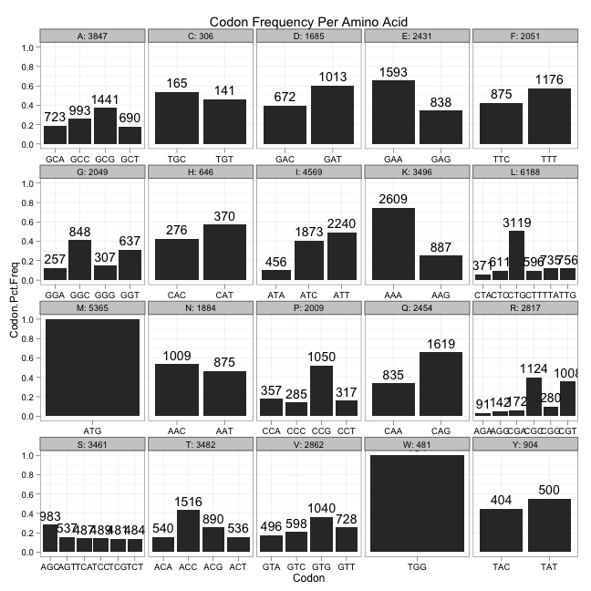 


Now let's try to look at the expression level for increasing instances of each amino acid. 


```r
get_aa_corr <- function(aa, dep = "Prot", df = ngs) {
    cdata <- merge(subset(aa.freq, AA == aa), df, all.x = T)
    csumm <- summary(lm(Freq ~ get(dep), data = cdata))
    cpearson <- with(subset(cdata, !is.na(get(dep))), cor.test(get(dep), Freq))
    dat <- data.frame(AA = aa, lm.r.squared = csumm$r.squared, lm.slope = csumm$coefficients[2, 
        1], lm.p.value = csumm$coefficients[2, 4], pson = cpearson$estimate, 
        pson.p.value = cpearson$p.value)
    dat$star <- ""
    dat$star[dat$pson.p.value <= 0.05/61] <- "*"
    dat$star[dat$pson.p.value <= 0.01/61] <- "**"
    dat$star[dat$pson.p.value <= 0.001/61] <- "***"
    
    return(dat)
}

aa.prot <- merge(aa.codon.totals, do.call(rbind, lapply(aa.codon.totals$AA, 
    get_aa_corr, dep = "Prot", df = ngs)), by = "AA", all = T)

ggplot(aa.prot, aes(y = pson, x = AA, label = star)) + geom_bar() + 
    geom_text(aes(vjust = 0.5 - sign(pson))) + theme_bw() + opts(title = "Pearson Correlation to Protein Level Per AA")
```

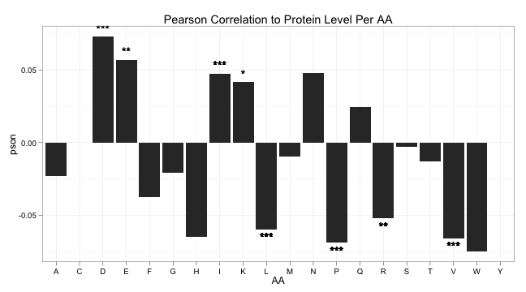 


Let's additionally look at translation efficiency and DNA, as a proxy for fitness.


```r
aa.teff <- merge(aa.codon.totals, do.call(rbind, lapply(aa.codon.totals$AA, 
    get_aa_corr, dep = "Trans", df = ngs)), by = "AA", all = T)

ggplot(aa.teff, aes(y = pson, x = AA, label = star)) + geom_bar() + 
    geom_text(aes(vjust = 0.5 - sign(pson))) + theme_bw() + opts(title = "Pearson Correlation to Translation Efficiency Per AA")
```

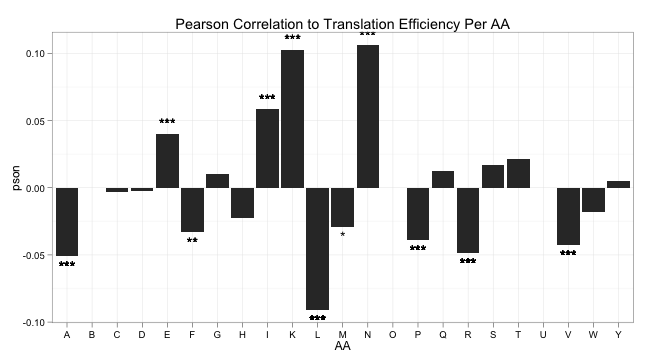 

```r

aa.dna <- merge(aa.codon.totals, do.call(rbind, lapply(aa.codon.totals$AA, 
    get_aa_corr, dep = "Count.DNA", df = ngs)), by = "AA", all = T)

ggplot(aa.dna, aes(y = pson, x = AA, label = star)) + geom_bar() + 
    geom_text(aes(vjust = 0.5 - sign(pson))) + theme_bw() + opts(title = "Pearson Correlation to DNA level Per AA")
```

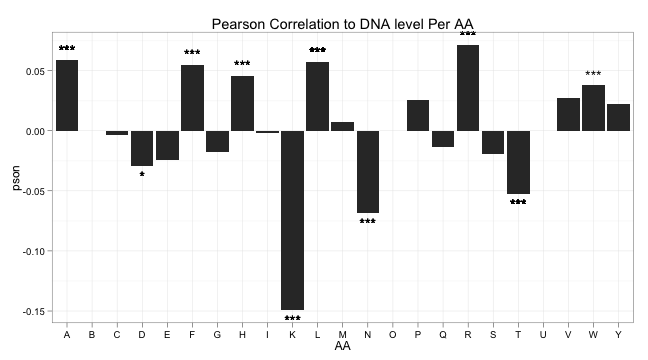 


Finally, let's split up the codons individually among the amino acids.


```r

get_codon_corr <- function(codon, dep = "Prot", df = ngs) {
    cdata <- merge(subset(codon.freq, Codon == codon), df, all.x = T)
    csumm <- summary(lm(Freq ~ get(dep), data = cdata))
    cpearson <- with(subset(cdata, !is.na(get(dep))), cor.test(get(dep), Freq))
    dat <- data.frame(Codon = codon, lm.r.squared = csumm$r.squared, lm.slope = csumm$coefficients[2, 
        1], lm.p.value = csumm$coefficients[2, 4], pson = cpearson$estimate, 
        pson.p.value = cpearson$p.value)
    
    dat$star <- ""
    dat$star[dat$pson.p.value <= 0.05/61] <- "*"
    dat$star[dat$pson.p.value <= 0.01/61] <- "**"
    dat$star[dat$pson.p.value <= 0.001/61] <- "***"
    
    return(dat)
}

codon.teff <- merge(codon.totals, do.call(rbind, lapply(codon.totals$Codon, 
    get_codon_corr, dep = "Trans", df = subset(ngs, Promoter = "BBaJ23100"))), 
    by = "Codon", all = T)

codon.teff$Codon = reorder(codon.teff$Codon, codon.teff$AA, sort)

ggplot(codon.teff, aes(y = pson, x = Codon, label = star, color = AA, 
    fill = AA)) + geom_bar() + geom_text(aes(vjust = 0.5 - sign(pson))) + theme_bw() + 
    opts(title = "Pearson Correlation to Translation Efficiency Per Codon, colored by AA", 
        axis.text.x = theme_text(angle = -90))
```

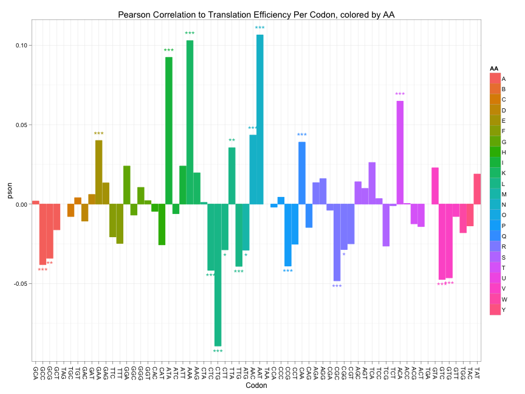 

```r

codon.dna <- merge(codon.totals, do.call(rbind, lapply(codon.totals$Codon, 
    get_codon_corr, dep = "Count.DNA", df = subset(ngs, Promoter = "BBaJ23100"))), 
    by = "Codon", all = T)

codon.dna$Codon = reorder(codon.dna$Codon, codon.dna$AA, sort)

ggplot(codon.dna, aes(y = pson, x = Codon, label = star, color = AA, 
    fill = AA)) + geom_bar() + geom_text(aes(vjust = 0.5 - sign(pson))) + theme_bw() + 
    opts(title = "Pearson Correlation to DNA Per Codon, colored by AA", axis.text.x = theme_text(angle = -90))
```

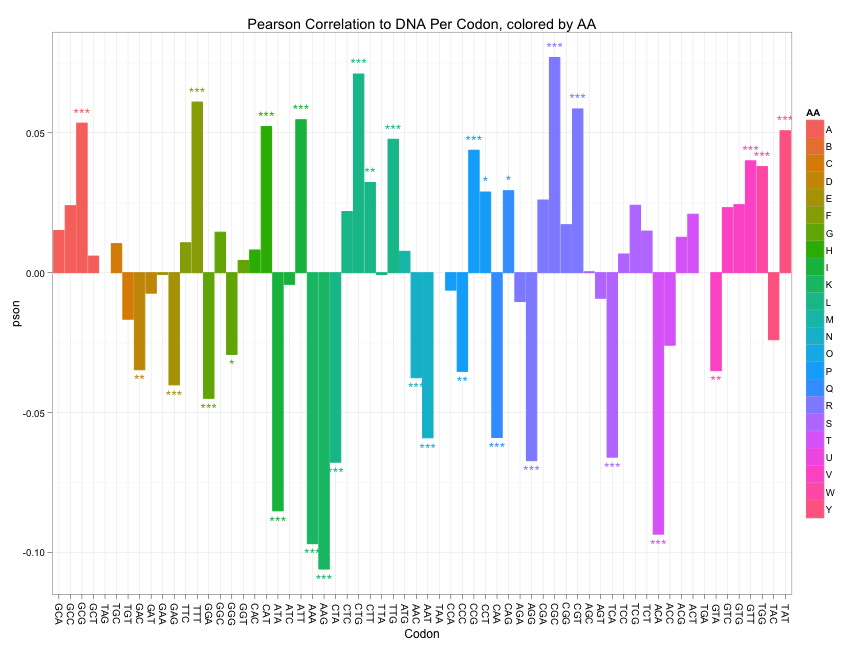 


So there is a trend here, but it's not very strong. Again, I'd like to plot the individual frequency versus translation efficiency so that I know that it is making sense.  The problem is that only a few (or maybe only one) gene has > 1 of some of the amino acids. 


```r
aa.example_aas <- c("L", "D", "A", "I", "V", "S")

aa.example_data <- merge(unique(subset(aa.freq, AA %in% aa.example_aas)), 
    ngs, by = c("CDS.seq", "Gene"))

aa.example_data$AA <- factor(aa.example_data$AA, levels = aa.example_aas)

aa.example_data <- merge(aa.example_data, aa.example_gene_counts)
```


```
## Error: object 'aa.example_gene_counts' not found
```


```r

# Jitter plots
ggplot(aa.example_data, aes(x = factor(Freq), y = log(Trans), color = rev(Promoter))) + 
    geom_jitter(alpha = 0.3, position = position_jitter(height = 0)) + facet_wrap(~AA, 
    ncol = 3, scale = "free_x")
```

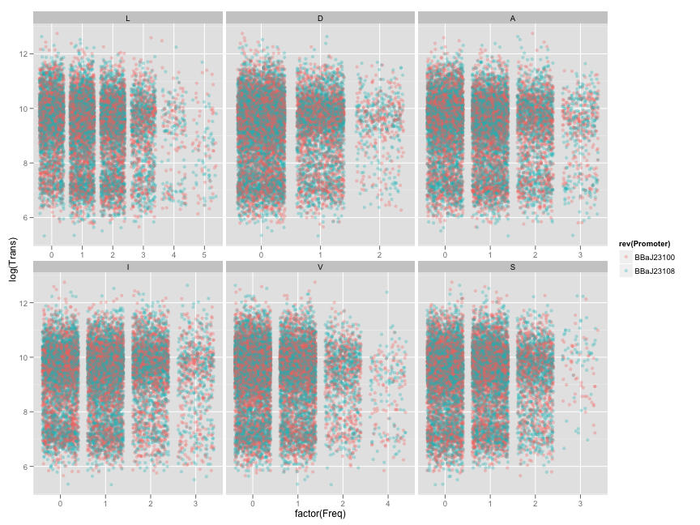 

```r

# Violin plots
ggplot(subset(aa.example_data, Promoter == "BBaJ23100"), aes(x = factor(Freq), 
    y = log(Trans))) + geom_violin() + opts(title = "Violin Density plots for Strong Promoter Translation") + 
    facet_wrap(~AA, ncol = 3, scale = "free_x")
```

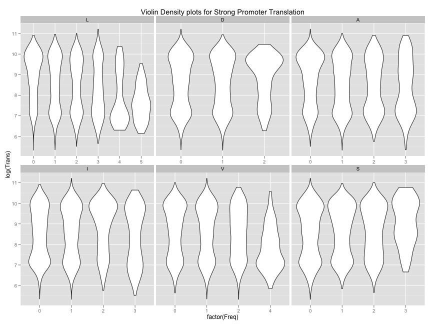 


Let's zoom in and just look at one amino acid that has no effect, A:


```r

aa.a_data <- subset(aa.example_data, AA == "A")
aa.a_data <- merge(aa.a_data, subset(codon.freq, Codon %in% subset(codon.txt, 
    AA == "A")$Codon), by = c("Gene", "CDS.seq"), suffixes = c(".AA", ".Codon"))
aa.a_data <- subset(aa.a_data, Freq.AA > 0)
aa.a_data$Pct.Codon <- aa.a_data$Freq.Codon/aa.a_data$Freq.AA
aa.a_data$Frac.Codon <- with(aa.a_data, factor(Pct.Codon, labels = fractions(unique(sort(Pct.Codon)))))

ggplot(aa.a_data, aes(x = Codon, y = log(Trans), color = Codon)) + 
    geom_jitter(alpha = 0.3, position = position_jitter(height = 0)) + scale_x_discrete(name = "Fraction of Alanines with this Codon") + 
    facet_wrap(~Frac.Codon, ncol = 3, scale = "free_x") + opts(axis.text.x = theme_text(angle = -90))
```

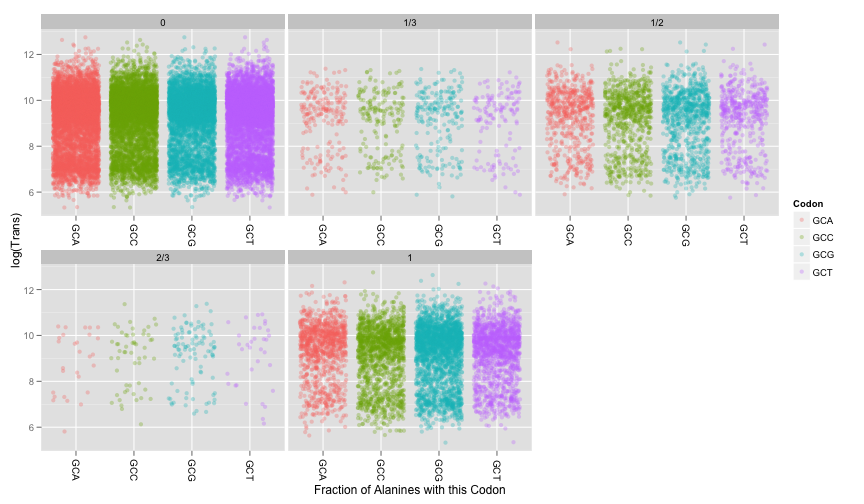 

```r

ggplot(aa.a_data, aes(x = Codon, y = log(Trans), color = Codon)) + 
    geom_violin() + scale_x_discrete(name = "Fraction of Alanines with this Codon") + 
    facet_wrap(~Frac.Codon, ncol = 3, scale = "free_x") + opts(axis.text.x = theme_text(angle = -90))
```

 

```r

ggplot(aa.a_data, aes(x = Codon, y = log(Count.DNA), color = Codon)) + 
    geom_jitter(alpha = 0.3, position = position_jitter(height = 0)) + scale_x_discrete(name = "Fraction of Alanines with this Codon") + 
    facet_wrap(~Frac.Codon, ncol = 3, scale = "free_x") + opts(axis.text.x = theme_text(angle = -90))
```

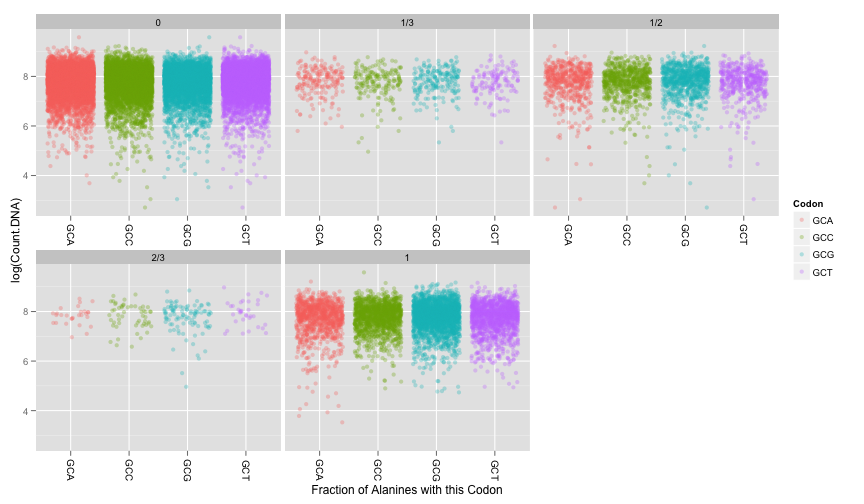 

```r

ggplot(aa.a_data, aes(x = Codon, y = log(Count.DNA), color = Codon)) + 
    geom_violin() + scale_x_discrete(name = "Fraction of Alanines with this Codon") + 
    facet_wrap(~Frac.Codon, ncol = 3, scale = "free_x") + opts(axis.text.x = theme_text(angle = -90))
```

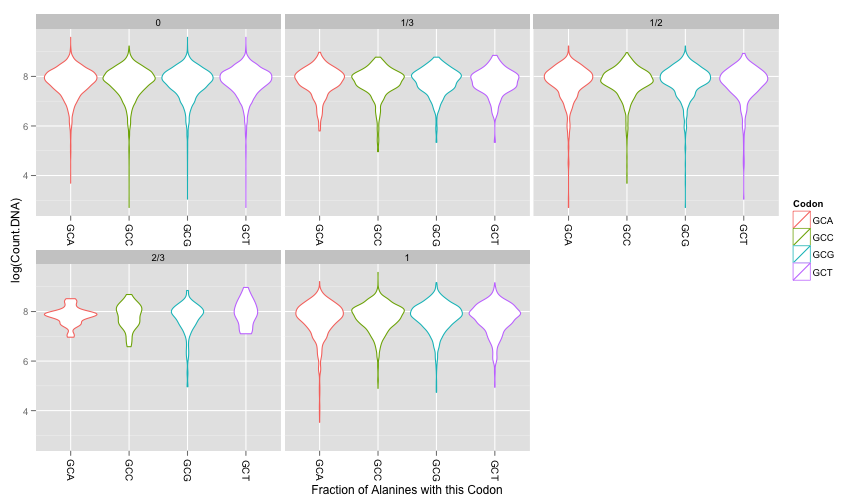 


So we don't see a strong effect in either translation efficiency or DNA.

Now let's do the same for an amino acid that has a strong effect and is different per codon; L:


```r

aa.l_data <- subset(aa.example_data, AA == "L")
aa.l_data <- merge(aa.l_data, subset(codon.freq, Codon %in% subset(codon.txt, 
    AA == "L")$Codon), by = c("Gene", "CDS.seq"), suffixes = c(".AA", ".Codon"))
aa.l_data <- subset(aa.l_data, Freq.AA > 0)
aa.l_data$Pct.Codon <- aa.l_data$Freq.Codon/aa.l_data$Freq.AA
aa.l_data$Frac.Codon <- with(aa.l_data, factor(Pct.Codon, labels = fractions(unique(sort(Pct.Codon)))))

# Trans
ggplot(aa.l_data, aes(x = Codon, y = log(Trans), color = Codon)) + 
    geom_jitter(alpha = 0.3, position = position_jitter(height = 0)) + scale_x_discrete(name = "Fraction of Leucines with this Codon") + 
    facet_wrap(~Frac.Codon, ncol = 3, scale = "free_x") + opts(axis.text.x = theme_text(angle = -90))
```

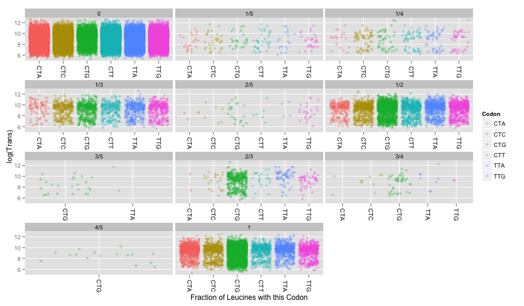 

```r

ggplot(aa.l_data, aes(x = Codon, y = log(Trans), color = Codon)) + 
    geom_violin() + scale_x_discrete(name = "Fraction of Leucines with this Codon") + 
    facet_wrap(~Frac.Codon, ncol = 3, scale = "free_x") + opts(axis.text.x = theme_text(angle = -90))
```

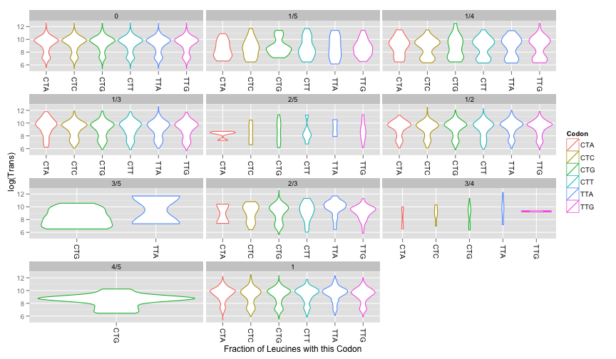 

```r

ggplot(aa.l_data, aes(x = Frac.Codon, y = log(Trans), color = Codon)) + 
    geom_violin() + scale_x_discrete(name = "Fraction of Leucines with this Codon") + 
    facet_wrap(~Codon, ncol = 3, scale = "free_x") + opts(axis.text.x = theme_text(angle = -90))
```

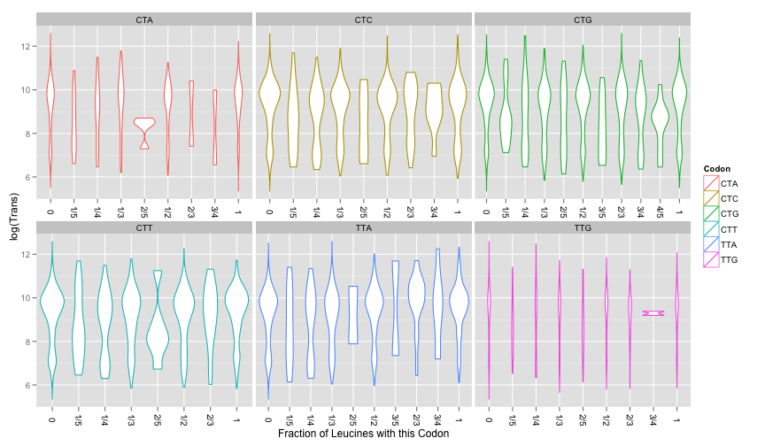 

```r

# DNA
ggplot(aa.l_data, aes(x = Codon, y = log(Count.DNA), color = Codon)) + 
    geom_jitter(alpha = 0.3, position = position_jitter(height = 0)) + scale_x_discrete(name = "Fraction of Leucines with this Codon") + 
    facet_wrap(~Frac.Codon, ncol = 3, scale = "free_x") + opts(axis.text.x = theme_text(angle = -90))
```

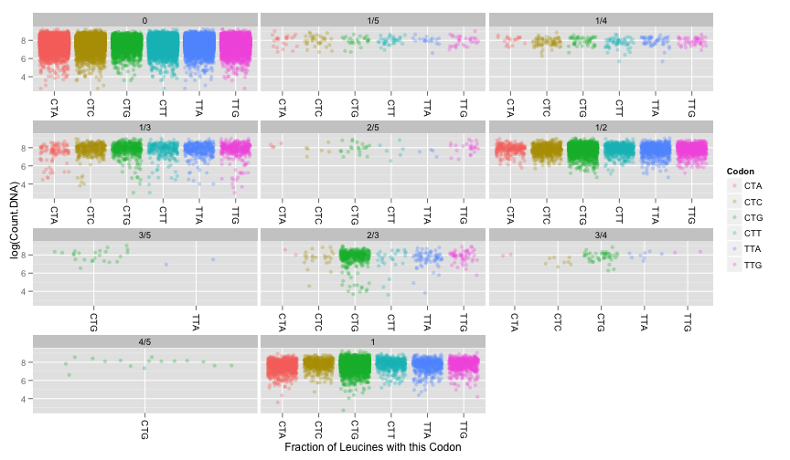 

```r

ggplot(aa.l_data, aes(x = Codon, y = log(Count.DNA), color = Codon)) + 
    geom_violin() + scale_x_discrete(name = "Fraction of Leucines with this Codon") + 
    facet_wrap(~Frac.Codon, ncol = 3, scale = "free_x") + opts(axis.text.x = theme_text(angle = -90))
```

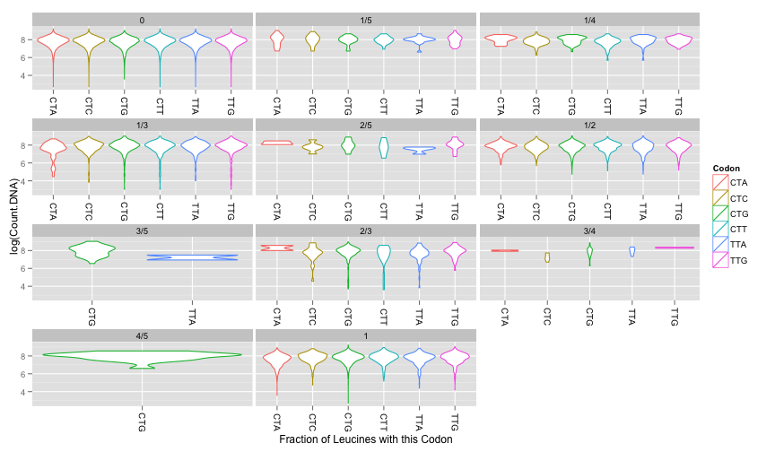 

```r

ggplot(aa.l_data, aes(x = Frac.Codon, y = log(Count.DNA), color = Codon)) + 
    geom_violin() + scale_x_discrete(name = "Fraction of Leucines with this Codon") + 
    facet_wrap(~Codon, ncol = 3, scale = "free_x") + opts(axis.text.x = theme_text(angle = -90))
```

 


So I definitely see a difference between TTA and CTG, for instance, which if we look above, do indeed show differences in expression individually for the Codon grid plots above. It could be simply due to CG content though. 

Just for kicks, there is 1 tRNA copy of the uAA anticodon (for TTA) and 4 copies of the cAG codon (for CTG). We would expect the codon with fewer tRNAs to decrease expression, or at least decrease fitness (in the DNA). There is a slight effect.

In any case, all these effects are pretty weak. I think I'm ready to move away from individual codon/AA analysis; I don't see anything striking here. I might come back to it later when I know more about the roles that GC content, CAI, tAI, and secondary structure all play.

## GC Content

First, let's calculate GC content and look at its distribution and correlation with RNA, DNA, Protein, and Translation efficiency. 


```r
get_gc_content <- function(seq) {
    nt <- table(factor(unlist(strsplit(seq, "")), levels = c("A", "T", "G", 
        "C")))
    nt <- as.data.frame(nt)
    gc <- with(nt, sum(Freq[Var1 %in% c("G", "C")])/sum(Freq))
    return(gc)
}

# Get CDS GC content
gc.CDS <- data.frame(CDS.seq = levels(lib_seqs$CDS.seq), CDS.GC = unlist(lapply(levels(lib_seqs$CDS.seq), 
    get_gc_content)))
lib_seqs <- merge(lib_seqs, gc.CDS)

# Get RBS+CDS GC content
seq_factor <- factor(with(lib_seqs, paste(as.character(RBS.seq), 
    as.character(CDS.seq), sep = "")))
lib_seqs$GC <- unlist(lapply(as.character(seq_factor), get_gc_content))

ngs <- merge(ngs, lib_seqs[, c("Name", "GC", "CDS.GC")], by = "Name")

ggplot(melt(ngs, measure.vars = c("GC", "CDS.GC"), variable_name = "GC_type"), 
    aes(x = value, fill = GC_type)) + geom_bar() + theme_bw() + opts(title = "%GC Distribution For CDS and CDS+RBS")
```

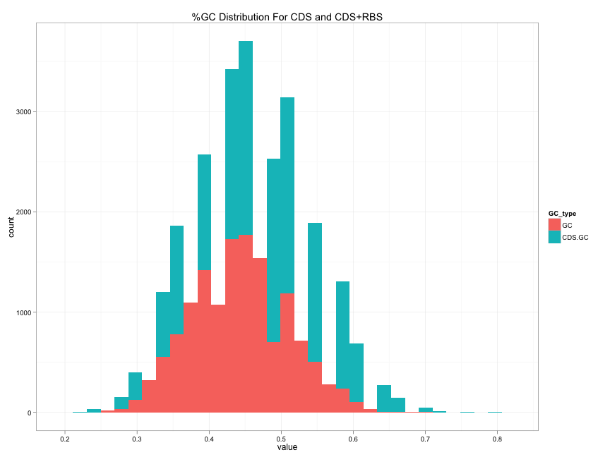 

```r

ggplot(melt(ngs, measure.vars = c("RNA", "Count.DNA", "Prot", "Trans")), 
    aes(x = GC, color = Promoter, y = value)) + geom_point(alpha = 0.05) + theme_bw() + 
    stat_smooth(method = lm, se = F) + facet_wrap(~variable, scale = "free", 
    ncol = 2) + scale_y_log10("Log10 of Dependent Variable") + opts(title = "%GC correlations For CDS+RBS")
```

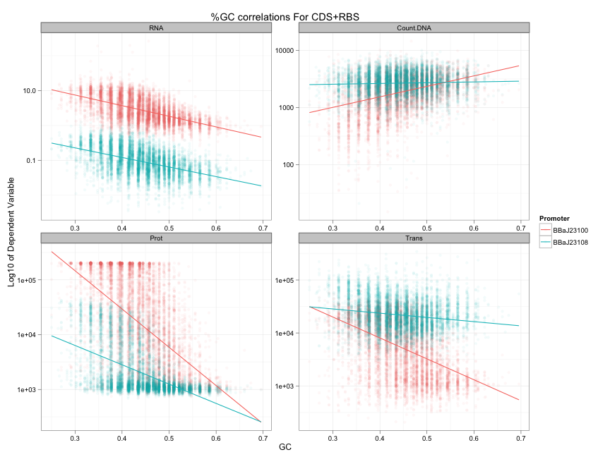 

```r

# By RBS, Strong Promoter
ggplot(melt(subset(ngs, Promoter == "BBaJ23100"), measure.vars = c("RNA", 
    "Count.DNA", "Prot", "Trans")), aes(x = GC, color = RBS, y = value)) + geom_point(alpha = 0.05) + 
    theme_bw() + stat_smooth(method = lm, se = F) + facet_wrap(RBS ~ variable, 
    scale = "free") + scale_y_log10("Log10 of Dependent Variable") + opts(title = "%GC correlations For CDS+RBS (Strong Promoter only)")
```

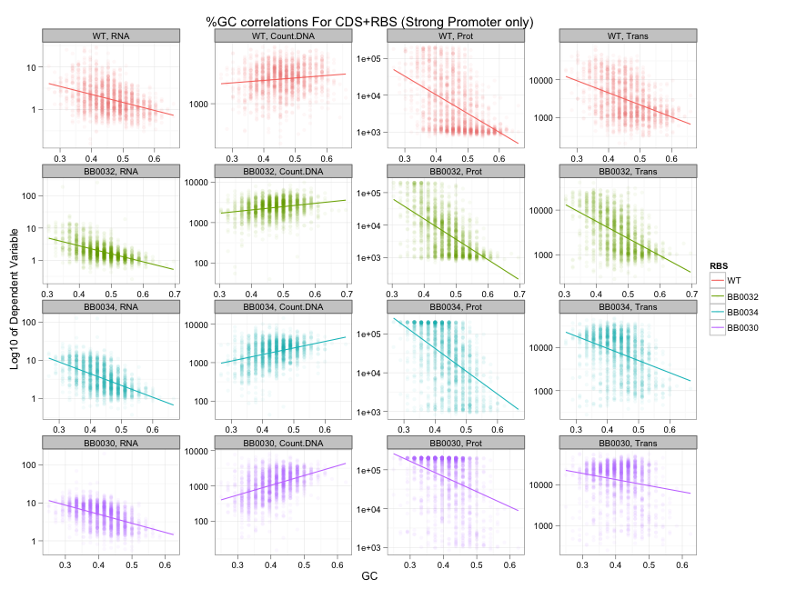 

```r

# By RBS, Weak Promoter
ggplot(melt(subset(ngs, Promoter == "BBaJ23108"), measure.vars = c("RNA", 
    "Count.DNA", "Prot", "Trans")), aes(x = GC, color = RBS, y = value)) + geom_point(alpha = 0.05) + 
    theme_bw() + stat_smooth(method = lm, se = F) + facet_wrap(RBS ~ variable, 
    scale = "free") + scale_y_log10("Log10 of Dependent Variable") + opts(title = "%GC correlations For CDS+RBS (Weak Promoter only)")
```

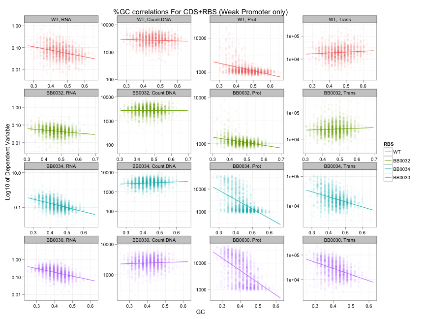 


These correlations look pretty strong. I'll go back later and print out the R-squareds etc. for each. I don't see any differences between RBS, but some of the effects are modulated by the promoter.

Vatsan suggests that I use enthalpy or free energy of hybridization along the X axis instead of GC content; he thinks the x-axis will 'open' up, allowing more robust correlation. This is assuming that the %GC trend is due to the extra energy required to open the double-stranded DNA during transcription. 

## Correlation to Genome-wide Codon Usage and Codon Adaptation Index

>TODO: Usage Codon Frequency in the genome in `codon.txt` that I got from George/Marc to see if this 'codon ramp' that Pilpel sees is really happening. I should read the codon ramp paper again also. 


## tRNA Count and tRNA Adaptation Index

>TODO: Calculate TAI with the R script I found for each sequence, look for an effect. 


